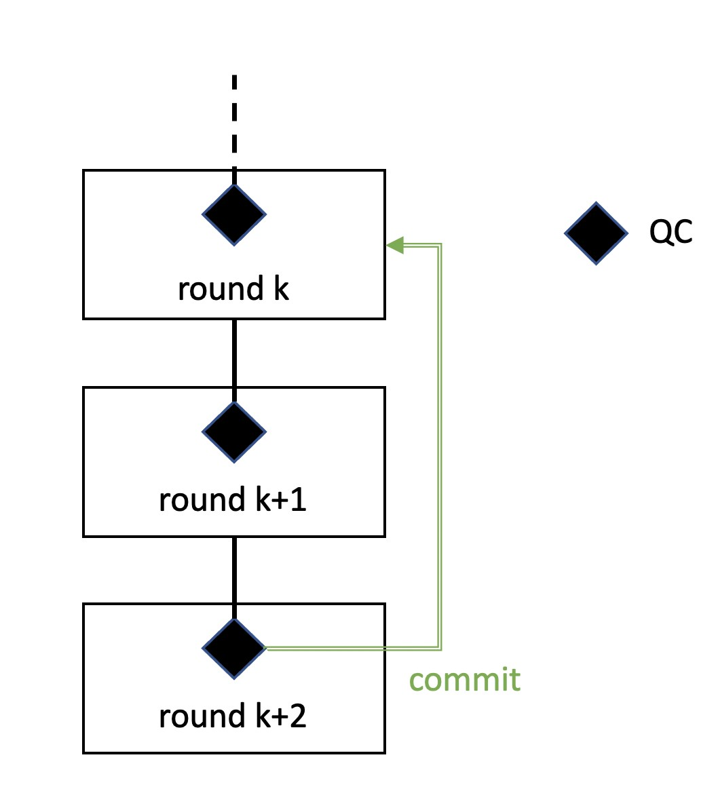
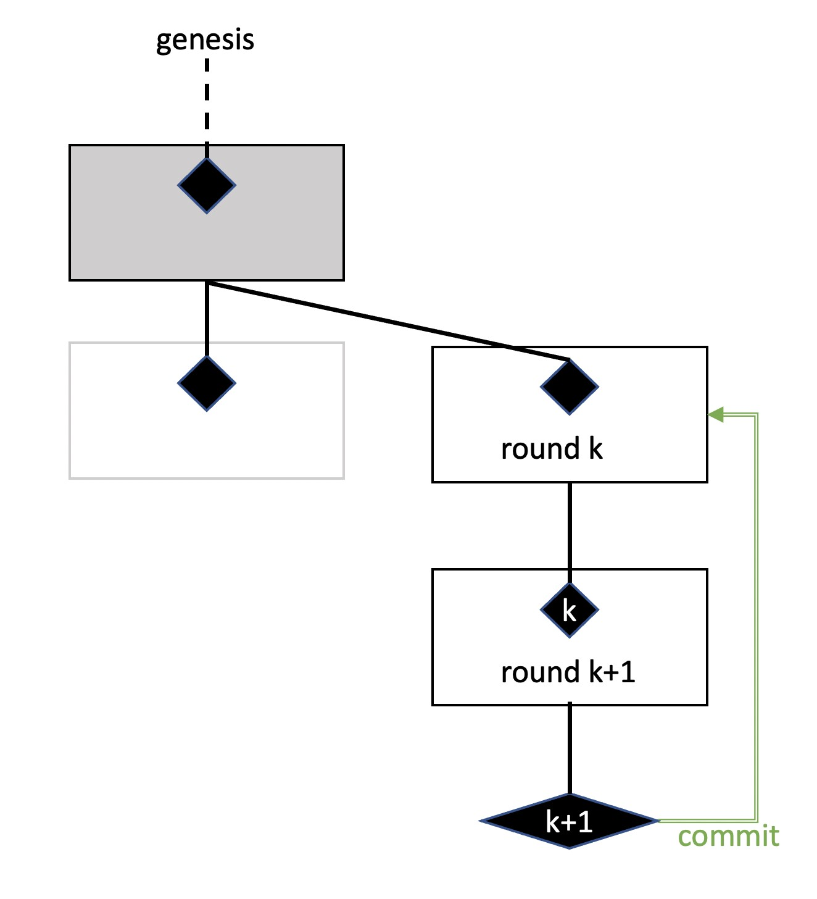
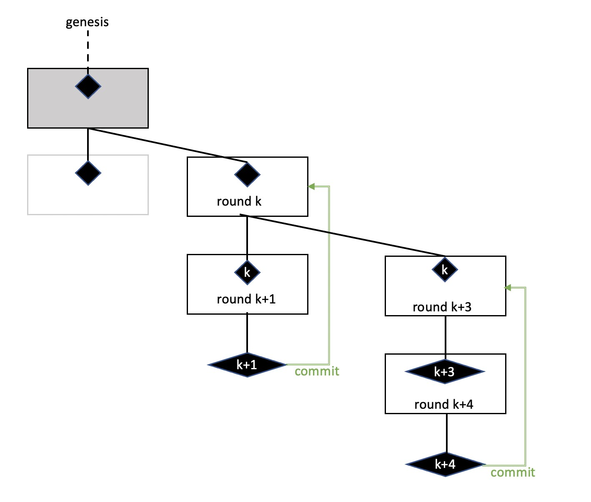
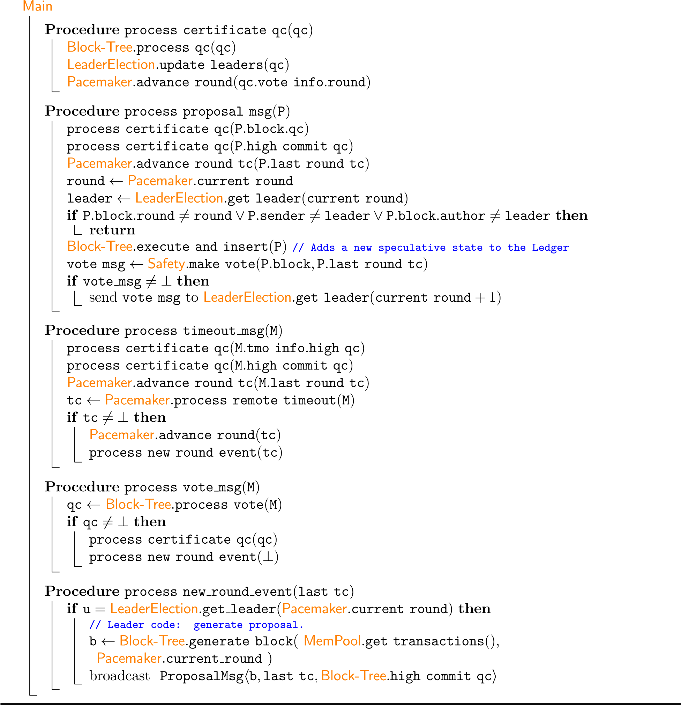
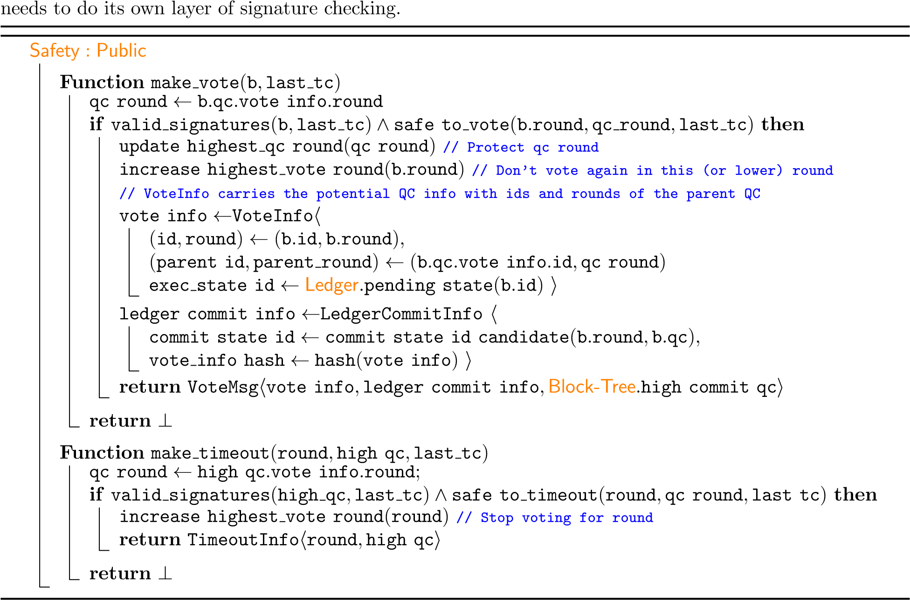
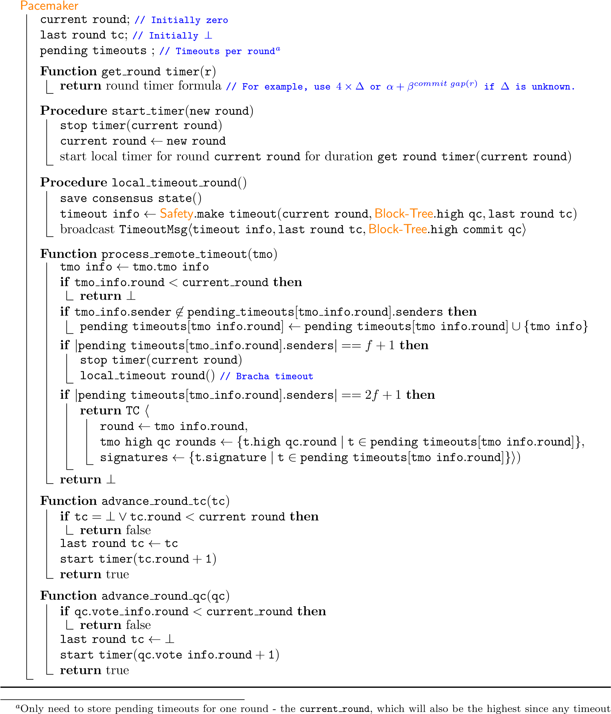
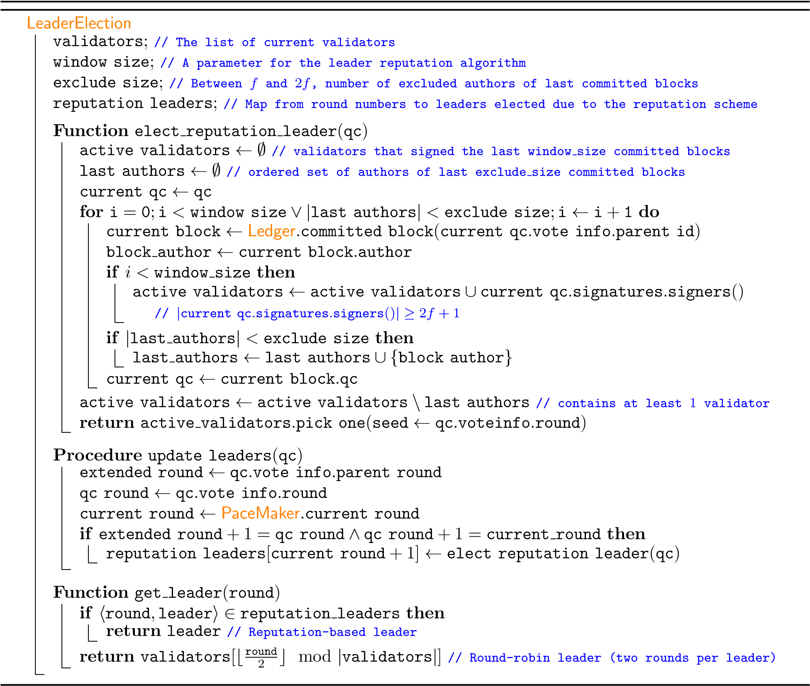

# DiemBFT v4：Diem区块链中的状态机复制

## 摘要 Abstract

本报告描述了 Diem 共识算法核心第4个版本，它被称为 DiemBFT。DiemBFT 负责保证一组可配置的验证节点之间就交易的排序和确定达成一致。本报告的主要目标是改善以前版本的延迟。我们认识到，在出现故障的领导者时，以前版本的视图同步协议需要平方数量的消息。DiemBFT接受了这种设计选择，在领导者失败时的使用二次视图切换，这使它能够在稳定状态下分两步而不是三步去提交区块。此外，DiemBFT还整合了一个领导者声誉机制，在崩溃故障下提供领导者利用率机制，确保并非所有提交的区块都由拜占庭领导者提出。领导者利用率机制保证崩溃的领导者不会当选，从而防止不必要的延迟。最后，DiemBFT将“安全隔离”保证形式化。它将参与者的正确行为封装在具有恒定内存占用的“tcb”模块中，使其能够在安全的硬件飞地中运行，从而减少参与者的攻击面。

This report describes the 4th version of the algorithmic core of Diem consensus, named DiemBFT, which is responsible for forming agreement on ordering and finalizing transactions among a configurable set of validators. The main goal of this report is to improve the latency of previous versions. We recognize that in the presence of a failed leader the view synchronization protocol of previous versions requires a quadratic number of messages. DiemBFT embrace this design choice and adopt a quadratic view-change of failed leaders, which enables it to commit blocks in two steps instead of three in the steady state. Additionally, DiemBFT incorporates a leader reputation mechanism that provides leader utilization under crash faults while making sure that not all committed blocks are proposed by Byzantine leaders. Leader utilization guarantees that crashed leaders are not elected, preventing unnecessary latency delays. Finally, DiemBFT formalizes the “safety isolation” guarantees. It encapsulates the correct behavior by participants in a “tcb”-able module of constant memory footprint, allowing it to run within a secure hardware enclave that reduces the attack surface on participants.

## 简介 Introduction

互联网和移动宽带的出现将全球数十亿人连接在一起，提供了获取知识、自由通信和一系列成本更低、更方便的服务。这种连通性也让更多的人能够进入金融生态系统。然而，尽管取得了这些进展，最需要金融服务的人获得金融服务的机会仍然有限。

The advent of the internet and mobile broadband has connected billions of people globally, providing access to knowledge, free communications, and a wide range of lower-cost, more convenient services. This connectivity has also enabled more people to access the financial ecosystem. Yet, despite this progress, access to financial services is still limited for those who need it most.

区块链和加密货币已经表明，计算机科学、密码学和经济学的最新进展有可能在金融基础设施中产生创新，但现有系统尚未得到主流采用。作为朝着这一目标迈出的下一步，我们设计了Diem区块链，其使命是实现一个简单的全球货币和金融基础设施，为数十亿人提供支持。

Blockchains and cryptocurrencies have shown that the latest advances in computer science, cryptography, and economics have the potential to create innovation in financial infrastructure, but existing systems have not yet reached mainstream adoption. As the next step toward this goal, we have designed the Diem Blockchain with the mission to enable a simple global currency and financial infrastructure that empowers billions of people.


这个新区块链的核心是一个名为DiemBFT的共识协议。该协议是本报告的重点，用于区块链交易的排序和最终确定。Diem区块链通过采用了BFT方法，使用DiemBFT共识协议，促进所有验证节点在交易账本上达成一致。

At the heart of this new blockchain is a consensus protocol called DiemBFT— the focus of this report — by which blockchain transactions are ordered and finalized. To facilitate agreement among all validator nodes on the ledger of transactions, the Diem Blockchain adopted the BFT approach by using the DiemBFT consensus protocol.

DiemBFT包含几个重要的设计考虑因素。

DiemBFT encompasses several important design considerations.

### 许可和开放网络 Permissioned & Open Network

DiemBFT的安全性取决于验证节点运维者的质量。与使用工作量证明选举验证节点委员会的先前工作[14]不同， 协会成员或Diem Networks US批准的第三方代表他们对 DiemBFT 的验证节点进行运维。这种模式被称为许可模式，基于参与协会成员的质量促进网络安全，并允许在不浪费过多计算能力的情况下实现可持续发展。

The security of DiemBFT depends on the quality of validator node operators. Unlike prior work [14] that elects validator committees using Proof-of-Work, validator nodes in DiemBFT will be run by members of the Association or third-party operators approved by Diem Networks US to operate a validator node on their behalf. This model is referred to as permissioned, an approach that promotes security of the network based on the quality of participating Association Members and allows for sustainability without wasting excessive computational power.

### 经典的BFT Classical BFT

DiemBFT以Lamport、Pease和Schostack在[15]中开创的经典BFT方法为基础。与其他区块链中使用的“工作证明”相比，这一领域40年的科学进步实现了高交易吞吐量、低延迟和更节能的共识方法。

DiemBFT builds on a classical BFT approach pioneered by Lamport, Pease and Schostack in [15]. Four decades of scientific advances in this arena enable high transaction throughput, low latency, and a more energy-efficient approach to consensus than “proof of work” used in some other blockchains.

这种方法提供的主要保证是对拜占庭式故障的恢复能力——防止单个故障污染整个系统。DiemBFT 旨在掩盖三分之一参与者所进行的任何偏离正确的行为。这些行为涵盖了从良性的节点存储翻转故障到通过窃取服务器密钥来完全破坏服务器的任何内容。此外，DiemBFT即使在无限制的通信延迟或网络中断期间也能保持安全。这反映了我们的信念，即安全性依赖于同步性的共识协议本质上既复杂又容易受到网络上的拒绝服务（DoS）攻击。

The main guarantee provided in this approach is resilience against Byzantine failures – preventing individual faults from contaminating the entire system. DiemBFT is designed to mask any deviation from correct behavior in a third of the participants. These cover anything from a benign bit flipping in a node’s storage to fully compromising a server by stealing its secret keys. Additionally, DiemBFT maintains safety even during periods of unbounded communication delays or network disruptions. This reflects our belief that consensus protocols whose safety rely on synchrony would be inherently both complex and vulnerable to Denial-of-Service (DoS) attacks on the network.

这种方法为DiemBFT提供的第二个重要保证是明确的交易最终性——当参与者看到来自法定人数(Quorum)个的验证节点的交易确认时，他们可以确保交易已经完成。

A second important guarantee this approach provides for DiemBFT is a clearly described transaction finality — when a participant sees confirmation of a transaction from a quorum of validators, they can be sure that the transaction has completed.

### 增强功能 Enhancements

DiemBFT允许简单而稳健的实现，与基于中本共识的公有区块链实现并行[16]。值得注意的是，该协议围绕单个通信阶段进行组织，允许简洁的安全论证和鲁棒性实现。因此， DiemBFT在基于中本共识的公有区块链的简单性和模块性之间架起了桥梁，但建立了基于协会集体可信赖性的信任。

DiemBFT allows simple and robust implementation, paralleling that of public blockchains based on Nakamoto consensus [16]. Notably, the protocol is organized around a single communication phase and allows a concise safety argument and a robust implementation. DiemBFT thus bridges between the simplicity and modularity of public blockchains based on Nakamoto consensus, but builds trust based on the collective trustworthiness of the Association.

DiemBFT会在两个不同的情况下更换领导者。首先，在正常操作中，DiemBFT在验证节点之间轮换领导者角色，以提供公平性和对称性。这不需要任何额外的通信。然而，如果使用例如轮转等过于简单的领导者选举机制，可能会产生很大的延迟开销，因为崩溃的领导者会继续当选。在DiemBFT中，我们设计了一种新的领导者选举机制，以实现领导者利用率。也就是说，崩溃的领导者当选为领导者的次数是有上限的。领导者选举机制利用最后提交的状态来实施跟踪活跃验证节点的信誉方案。棘手的部分是就最后的提交状态达成一致。如果天真地实现这个协议，拜占庭式的对手可能会让诚实的验证节点在领导者问题上产生分歧，这反过来可能会导致活性或链质量出现问题。

DiemBFT changes leaders in two separate cases. First, in normal operation DiemBFT rotates the leaderrole among validators in order to provide fairness and symmetry. This does not require any extra communication. However, if done naively (e.g., round-robin), this may incur a big latency overhead since crashed leaders would keep being elected. In DiemBFT we design a novel leader election mechanism that achieves leader utilization. That is, the number of times a crashed leader is elected as leader is bounded. The leader election mechanism exploits the last committed state to implement a reputation scheme that tracks active validators. The tricky part is to agree on the last committed state. If done naively, a Byzantine adversary can make honest parties disagree on the leaders, which in turn may cause liveness or chain quality violations.

其次，当领导者被认为有缺陷时，DiemBFT会更换他们。前一个版本使用了 HotStuff 算法的线性视图切换机制来替换错误的领导者。然而，由于之前版本中的视图同步无论如何都需要二次通信，因此DiemBFT使用二次视图切换机制，这允许DiemBFT在常见情况下减少HotStuff延迟。在HotStuff术语中，DiemBFT具有一个两链提交规则。这使得DiemBFT成为HotStuff（正常路径）和PBFT [6]（领导者错误路径）的混合体。因此，在一个稳定的网络中，它有 HotStuff 的线性成本，但在不稳定的情况下，它每轮需要二次方的消息数，而在更糟糕的情况下，它会需要类似于PBFT的三次方消息数。至于视图同步，DiemBFT建立在以前版本中引入的超时证书之上，并为超时消息添加了受 Bracha 广播[1] 启发的推进机制，以确保所有诚实的验证节点以大致相同的速度推进轮次。

Second, DiemBFT changes leaders when they are considered faulty. The previous version used the HotStuff linear view change mechanism to replace faulty leaders. However, since the view synchronization in previous versions requires quadratic communication anyway, DiemBFT uses a quadratic view-change mechanism that allows DiemBFT to reduce the HotStuff latency in the common case. In HotStuff terminology, DiemBFT has a 2-chain commit rule. This makes DiemBFT a hybrid between Hotstuff (common-case execution) and PBFT [6] (faulty leader execution). As a result during a stable network it has the linear cost of HotStuff, but during instability it pays a quadratic cost per round to a worse-case cubic cost similar to PBFT. As for the view synchronization, DiemBFT builds on top of the time-out certificates that was introduced in previous versions and adds a Bracha broadcast[1] inspired boosting mechanism for timeout messages to guarantee that all honest validators advance rounds in roughly the same speed.

最后，DiemBFT 中的验证节点可以通过仅在本地存储少量（恒定）信息来验证隔离安全模块中的安全性。这可以对三种类型的验证节点进行建模：诚实、受损和拜占庭。在受损类型的验证节点中，攻击者可以控制受损验证节点但无法访问其安全模块。只要拜占庭验证节点的数量少于 1/3，不论受感染验证节点有多少，DiemBFT 都可以保证安全性。

Finally, validators in DiemBFT can verify safety in an isolated secure safety module by only storing locally a small (constant) amount of information. This enables the modeling of three types of validators: honest, compromised, and Byzantine, such that an adversary controls a compromised validator but cannot access its safety module. DiemBFT guarantees safety for any number of compromised validators as long as the faction of Byzantine ones is less than 1/3.

## 问题定义 Problem Definition

DiemBFT 的目标是维护具有容错能力的可编程资源数据库。该系统的核心是围绕 SMR 引擎设计的，在该引擎中，验证节点就一系列交易达成一致，并确定性地将它们按顺序应用到副本数据库中。

The goal of DiemBFT is to maintain a database of programmable resources with fault tolerance. At the core, the system is designed around an SMR engine where validators form agreement on a sequence of transactions and apply them in sequence order deterministically to the replicated database.

DiemBFT 专为经典设置而设计，其中初始系统由 n 个验证节点的网络系统组成。初始成员集在系统初始化时确定。为了模拟故障，我们定义了一个控制网络延迟和一些验证节点行为的对手。我们假设一个安全的可信主机并定义三种类型的验证节点：
- 拜占庭验证节点——所有代码都由对手控制。
- 受损的验证节点——安全可信主机之外的所有代码都由攻击者控制。
- 诚实的验证节点——没有任何东西是由对手控制的

DiemBFT is designed for a classical settings in which an initial system consists of a networked system of n validators. The initial set of members is determined when the system is bootstrapped. To model failures, we define an adversary that controls the network delays and the behavior of some of the validators. We assume a secure trusted host and define three types of validators:
- Byzantine validator - all code is controlled by the adversary.
- Compromised validator - all code outside the secure trusted host is controlled by the adversary.
- Honest validator - nothing is controlled by the adversary

我们将诚实和被破坏的验证节点统称为非拜占庭验证节点，并假设所有验证节点都可能被破坏，但最多有 f < n/3 个拜占庭验证节点。协议属性要求诚实的验证节点永远不会提交相互矛盾的链前缀。请注意，受感染的验证节点可能会在本地提交任何内容，因为提交的信息存储在受信任的硬件模块之外。但是，受损的验证节点不会导致诚实的验证节点违反协议。

We collectively refer to honest and compromised validators as non-Byzantine validators and assume that all validators might be compromised, but there are at most f < n/3 Byzantine validators. The Agreement property requires that honest validators never commit contradicting chain prefixes. Note that compromised validators might locally commit anything since the committed information is stored outside the trusted hardware module. However, compromised validators cannot cause honest ones to violate agreement.

### 系统模型 System Model

#### 网络 Network

DiemBFT的网络模型是同步和异步模型的混合，称为部分同步。它对实际情景进行建模，其中网络经历短暂的异步阶段（例如，受到攻击）并在其余时间保持同步。

The network model which is assumed for DiemBFT is a hybrid between synchronous and asynchronous models called partial synchrony. It models practical settings in which the network goes through transient periods of asynchrony (e.g., under attack) and maintains synchrony the rest of the times.

Dwork 等人介绍的部分同步设置的解决方法 [9] 将安全（在任何时候）与活跃（在同步期间）分开。DLS引入了逐轮模式，每一轮都由指定的领导者驱动。在同步期间，只要诚实的领导者出现，就可以保证进展。如果其没有出现，轮次会因超时而停止。DLS 方法是迄今为止最实用的 BFT 工作以及业内最成功的可靠性解决方案的基础，例如，谷歌 Google Chubbie lock service[3]、Yahoo’s ZooKeeper [13]、etcd [10]、Google’s Spanner[8]、Apache Cassandra[5]等。

A solution approach for partially synchronous settings introduced by Dwork et al. [9] separates safety (at all times) from liveness (during periods of synchrony). DLS introduced a round-by-round paradigm where each round is driven by a designated leader. Progress is guaranteed during periods of synchrony as soon as an honest leader emerges, and until then, rounds are retired by timeouts. The DLS approach underlies most practical BFT works to date as well as the most successful reliability solutions in the industry, for example, the Google Chubbie lock service [3], Yahoo’s ZooKeeper [13], etcd [10], Google’s Spanner [8], Apache Cassandra [5] and others.

形式上，类似于同步网络，部分同步模型假设存在传输边界∆，以及一个称为GST（全局稳定时间）的特殊事件:
- GST最终会在未知的有限时间后发生。
- 在时间 t 发送的每条消息都必须在时间 max{t,GST} + Δ 之前传递。

Formally, the partial synchrony model assumes a ∆ transmission bound similar to synchronous networks, and a special event called GST (Global Stabilization Time) such that:
- GST eventually happens after some unknown finite time.
- Every message sent at time t must be delivered by time max{t,GST} + ∆.

我们封装了几个与 Wire 协议相关的任务，并将其推迟到其他地方进行描述。传输(transport) 负责格式化消息并将它们序列化以通过线路传输，可靠地传递消息，以及检索传递的消息引用的任何数据，特别是块祖先。特别的，当在伪代码中处理消息时，我们假设它的格式和签名已经过验证，并且接收者已完成消息中的所引用的祖先块和其他所需数据的同步。

We encapsulate several tasks related to wire-protocol and defer it to a transport substrate that will be described elsewhere. The transport takes care of formatting messages and serializing them for transmission over the wire, for reliably delivering messages, and for retrieving any data referenced by delivered messages, in particular, block ancestors. In particular, when a message is handled in the pseudo code, we assume that its format and signature has been validated, and that the receivers has synced up with all ancestors and any other data referenced by meta-information in the message.

### 技术背景 Technical Background

DiemBFT基于部分同步模型中的一系列拜占庭容错（BFT）复制协议，例如[9, 6, 12, 2, 4, 14, 17, 7]。它采用了这些作品中的尖端技术，以支持可编程资源的大规模副本数据库。

DiemBFT is based on a line of replication protocols in the partial synchrony model with Byzantine Fault Tolerance (BFT), e.g., [9, 6, 12, 2, 4, 14, 17, 7]. It embraces cutting-edge techniques from these works to support at scale a replicated database of programmable resources.

#### 逐轮BFT解决方案 Round-by-round BFT solutions.

实用BFT复制的经典解决方案有一个共同的基本方法。他们以循序渐进的方式运作。在每一轮中，都存在一个固定的映射，为该轮指定一个领导者（例如，通过轮次模参与者的数量n，round%n）。领导者的职责是在网络中为这个轮次填充一份唯一的提案。

The classical solutions for practical BFT replication share a common, fundamental approach. They operate in a round by round manner. In each round, there is a fixed mapping that designates a leader for the round (e.g., by taking the round modulo n, the number of participants). The leader role is to populate the network with a unique proposal for the round.

如果领导者在诚实的验证节点放弃这轮投票并暂停之前，向网络发布其提案，那么领导者就是成功的。在这种情况下，诚实的验证节点会参与该回合的协议阶段。许多经典的实用BFT解决方案在每轮中分两个阶段运行，每个决策产生二次方通信成本（例如PBFT [6]）。在第一阶段，法定人数的验证节点认证一个唯一的提案，形成法定人数证书或QC。在第二阶段，认证提案的法定投票数决定是否提交。未来几轮的领导者总是等待法定人数的验证节点报告他们投票选出的最高QC。如果法定人数的验证节点报告他们在第r轮中没有投票给任何QC，则这证明在第r轮中没有提交任何提案。

The leader is successful if it populates the network with its proposal before honest validators give up on the round and time out. In this case, honest validators participate in the protocol phases for the round. Many classical practical BFT solutions operate in two phases per round and incur quadratic communication cost per decision (e.g., PBFT [6]). In the first phase, a quorum of validators certifies a unique proposal, forming a quorum certificate, or a QC. In the second phase, a quorum of votes on a certified proposal drives a commit decision. The leaders of future rounds always wait for a quorum of validators to report about the highest QC they voted for. If a quorum of validators report that they did not vote for any QC in a round r, then this proves that no proposal was committed at round r.

另一方面，HotStuff是一种三阶段BFT复制协议，在常见情况下具有线性通信开销。在HotStuff中，一轮的第一和第二阶段类似于PBFT,但第二阶段的结果是认证证书或QC的QC，而不是提交决定。在QC的QC的投票(QC的QC的QC)达到法定人数后，即可做出提交决定。

HotStuff, on the other hand, is a three-phase BFT replication protocol that has linear communication overhead in the common-case. In HotStuff, the first and second phases of a round are similar to PBFT, but the result of the second phase is a certified certificate, or a QC-of-QC, rather then a commit decision. A commit decision is reached upon getting a quorum of votes on the QC-of-QC (a QC-of-QC-of-QC).

DiemBFT的灵感来自线性三阶段HotStuff,但摆脱了三阶段延迟成本。相反，当领导者还具有活性时，它保持了HotStuff的通信线性，但在视图切换协议期间允许二次通信成本，以重新获得二阶段提交的能力。
 
DiemBFT is inspired by the linear three-phase HotStuff, but gets rid of the three-step latency cost. Instead, it preserves the communication linearity of HotStuff when the leader is alive but allows for a quadratic cost during the view-change protocol to regain the ability to commit in two steps.



图1: DiemBFT管道提案和各轮QC生成

Figure 1: DiemBFT pipelines proposals and QC generation across rounds

### 链 Chaining

DiemBFT 借鉴了在区块链 BFT 协议中流行的链式范式。在链式方法中，提交阶段分布在各个回合中。更具体地说，每个阶段都进行一轮并包含一个新的提案。k轮的领导者对其提案只进行了一个阶段的认证。在下一轮的k + 1中，领导者再次推动了一个阶段的认证。这个阶段有多个目的。k + 1领导者发送自己的k + 1提案。然而，它也为k提案提供了QC支持。这样，在k + 1轮认证时，会生成k + 1的QC，以及k的QC的QC。因此，在两阶段协议中，当（k + 1）提案获得QC 时，k提案可以被提交。

DiemBFT borrows a chaining paradigm that has become popular in blockchain BFT protocols. In the chaining approach, the phases for commitment are spread across rounds. More specifically, every phase is carried in a round and contains a new proposal. The leader of round k drives only a single phase of certification of its proposal. In the next round, k + 1, a leader again drives a single phase of certification. This phase has multiple purposes. The k+1 leader sends its own k+1 proposal. However, it also piggybacks the QC for the k proposal. In this way, certifying at round k +1 generates a QC for k +1, and a QC-of-QC for k. As a result, in a 2-phase protocol, the k proposal can become committed, when the (k + 1) proposal obtains a QC.

#### 轮次同步 Round synchronization

在分布式系统中，在任何时刻，验证节点都可能处于不同的状态并接收不同的消息。PBFT 通过将轮次的持续时间加倍直到观察到进展，为轮次同步提供了一种理论上的“可能性”方法。HotStuff在一个名为 PaceMaker的模块中封装了推进轮次的职责，但未说明其实现。在DiemBFT中，当验证节点放弃某一轮（比如r）时，它会广播一条超时消息，其中包含进入该轮的证书。这将使所有诚实的验证节点在传输延迟∆内到达轮次r. 当从仲裁中收集超时消息时，它们会形成超时证书（TC）。TC 还包括 2f + 1 个节点在他们知道的最高轮 QC 上的签名。这也是领导者安全扩展链条的证据，即使某些验证节点锁定在比新选举的领导者更高的轮次中。为了确保GST后，所有验证节点都能够在o(∆)时间内为彼此形成 TC，我们使用Bracha [1]风格的机制转发超时消息。

In a distributed system, at any moment in time, validators may be in a different state and receive different messages. PBFT gave a theoretical “eventuality” method for round synchronization by doubling the duration of rounds until progress is observed. HotStuff encapsulated the role of advancing rounds in a functionality named PaceMaker, but left its implementation unspecified. In DiemBFT, when a validator gives up on a certain round (say r), it broadcasts a timeout message carrying a certificate for entering the round. This brings all honest validators to r within the transmission delay bound ∆. When timeout messages are collected from a quorum, they form a timeout certificate (TC). The TC also includes the signatures of the 2f + 1 nodes on the highest round QC they are aware of. This later serves as proof for the leader to safely extend the chain even if some parties are locked on a higher round than the one the newly elect leader. To make sure that, after GST, all validators are able to form TCs in a O(∆) time for each other we use a Bracha [1] style mechanism to forward the timeout messages.

## DiemBFT协议 DiemBFT Protocol

DiemBFT协议的目标是按顺序提交块。该协议在一系列轮次中运作。在每一轮中，一位领导者提出一个新的区块。验证节点将投票发送给下一轮的领导者。当投票达到法定人数时，下一轮的领导者将形成法定人数证书（QC），并将其嵌入下一个提案中。验证节点也可能在一轮超时时放弃。这可能会导致在没有获得QC的情况下过渡到下一轮，在这种情况下，验证节点形成或观察当前轮的超时证书（TC），通过视图切换机制进入下一轮。事实上，进入r + 1轮需要观察r轮的QC或TC。下一轮的领导者面临如何扩展其知道的当前块树的选择。在DiemBFT中，领导者总是从证书树的最高分支延伸直接子区块。其优点是块树具有统一的结构，每个区块都有一个直接父区块的 QC。作为DiemBFT链接方法的结果，DiemBFT中的块树可能包含在轮数中有间隙的链。

The goal of the DiemBFT protocol is to commit blocks in sequence. The protocol operates in a pipeline of rounds. In each round, a leader proposes a new block. Validators send their votes to the leader of the next round. When a quorum of votes is collected, the leader of the next round forms a quorum certificate (QC) and embeds it in the next proposal. Validators may also give up on a round by timeout. This may cause transition to the next round without obtaining a QC, in which case validators enter the next round through a view-change mechanism by forming or observing a timeout certificate (TC) of the current round. In fact, entering round r +1 requires observing either a QC or TC of round r. The leader of the next round faces a choice as to how to extend the current block-tree it knows. In DiemBFT the leader always extends the highest certified leaf with a direct child. The advantage is that the tree of blocks has a uniform structure and every node has a QC for its direct parent. As a consequence of the DiemBFT chaining approach, the block tree in DiemBFT may contain chains that have gaps in round numbers.

轮次信息被显式地包含在块中，判断何时提交的逻辑是很简单的：它需要一个2-链，其中包含连续的轮次数，其最后一个后代已被认证。当两个不间断的轮次完成时，“2-链”的头部（由已形成QC的两个连续回合组成）将被提交。参见图1中的插图。

Round numbers are explicitly included in blocks, and the resulting commit logic is simple: It requires a 2chain with contiguous round numbers whose last descendent has been certified. When two uninterrupted rounds complete, the head of the “2-chain”, consisting of the two consecutive rounds that have formed a QC, becomes committed. See illustration in Figure 1.

以新提交的块结尾的整个分支变为已提交状态。图2显示了一个块树，包括一个未提交的分叉。分叉可能是由于各种原因造成的，比如恶意领导者、消息丢失等。例如，该图显示了一个拜占庭领导者在区块 k 处分叉了该链，导致一条未提交的链被放弃。k 块对其父块使用与左叉相同的 QC。在所描述的场景中，k块被提交，而左分支被丢弃。请注意，正如我们稍后所解释的，我们的安全规则保证提交的分支永远不会被丢弃。

The entire branch ending with the newly committed block becomes committed. Figure 2 displays a tree of blocks, including an uncommitted fork. Forking can happen for various reasons such as a malicious leader, message losses, and others. For example, the figure shows a Byzantine leader that forked the chain at block k, causing an uncommitted chain to be abandoned. The k block uses the same QC for its parent as the left fork. In the depicted scenario, the k block becomes committed while the left branch is discarded. Note that, as we shortly explain, our safety rules guarantees that committed branches can never be discarded.



图2: 提交之前和之后在块树中待处理的提案（块）

Figure 2: Proposals (blocks) pending in the Block-tree before and after a commit


DiemBFT 通过由两个要素组成的简单投票规则保证只有一个分叉被提交：首先，验证节点在严格递增的轮次中投票。其次，每个区块必须包含上一轮的 QC 或 TC。 如果上一轮的结果是 TC，那么验证节点会检查新领导者的提议是否可以安全扩展。该检查包括查看来自不同节点的 2f+1 个 highest_qc_round（验证节点投票支持的块中包含的最高 QC）的 TC。 如果新提案扩展了这些 highest_qc_round 中的最高值，这可以证明更高一轮的任何内容都不能提交（否则至少有人会报告更高的最高 qc_round）。 考虑图 3 中描述的场景，其中 k + 4 QC 是在第 k + 3 轮提交块时形成的。在未来的轮次中，不可能形成一个允许扩展低于 k + 3 的 QC 的 TC。

DiemBFT guarantees that only one fork becomes committed through a simple voting rule that consists of two ingredients: First, validators vote in strictly increasing rounds. Second, each block has to include a QC or a TC from the previous round. If the previous round results in a TC then the validators check that the new leader’s proposal is safe to extend. This check consists of looking at the TC which bears the 2f +1 highest_qc_round (the highest QC included in a block the validator voted for) from distinct nodes. If the new proposal extends the highest of these highest_qc_round, this serves as proof that nothing from a round higher can even be committed (Otherwise at least one would have reported a higher highest_qc_round). Consider the scenario depicted in Figure 3, in which the k + 4 QC is formed committing the block from round k + 3. In future rounds it will be impossible to form a TC that would allow extending a lower QC than k + 3.



图 3：提交的区块形成一个单调递增的链。

Figure 3: Committed blocks form a monotonically increasing chain.

我们继续详细描述DiemBFT协议，详细说明实现中的数据结构和模块。实现分为以下几个模块:
- 首先是一个主模块（第3.1节），它是胶水、调度消息和计时器事件处理程序。
- 一个账本（第3.2节）模块，用于存储本地可分叉的推测性账本状态。它为SMR服务提供接口，并连接到更高级别的逻辑（执行）。
- 生成提案块的块树（第3.3节）模块。它通过投票和QC对等待提交的区块树进行跟踪。
- 实施核心共识安全规则的安全模块（第3.4节）。Safety: Private部分控制私钥，并处理签名的生成和验证。它维护所需的最小状态，并可由安全的硬件组件保护。
- 一个起搏器（第3.5节）模块，用于维持活性并推进轮次。它为安全模块提供了“节拍”。
- MemPool（第3.6节）模块，在生成提案时向领导提供交易。
- 最后，一个LeaderElection（第3.7节）模块将轮次映射到领导者，并在静态崩溃故障下实现最佳领导者利用率，同时在拜占庭式故障下保持链质量。

第4节给出了形式化的正确性证明。

We proceed with a detailed description of the DiemBFT protocol, elaborating the data-structures and modules in the implementation. The implementation is broken into the following modules:
- First, a Main (Section 3.1) module that is the glue, dispatching messages and timer event handlers.
- A Ledger (Section 3.2) module that stores a local, forkable speculative ledger state. It provides the interface for SMR service and to be connected to higher level logic (the execution).
- A Block-tree(Section 3.3) module that generates proposal blocks. It keeps track of a tree of blocks pending commitment with votes and QC’s on them.
- A Safety (Section 3.4) module that implements the core consensus safety rules. The Safety : Private part controls the private key and handles the generation and verification of signatures. It maintains minimal state and can be protected by a secure hardware component.
- A Pacemaker (Section 3.5) module that maintains the liveness and advances rounds. It provides a “hearbeat” to Safety.
- A MemPool (Section 3.6) module that provides transactions to the leader when generating proposals.
- Finally, a LeaderElection (Section 3.7) module that maps rounds to leaders and achieves optimal leader utilization under static crash faults while maintaining chain quality under Byzantine faults.
 
Formal correctness proofs are given in Section 4.

### 主模块 Main Module

```pseudocode
Main: EventLoop
	loop: wait for next event M; Main.start_event_processing(M)
	Procedure start_event_processing(M)
	if M is a local timeout then Pacemaker.local_timeout_round()
	if M is a proposal message then process_proposal_msg(M)
	if M is a vote message then process_vote_msg(M)
	if M is a timeout message then process_timeout_message(M)
```
 
DiemBFT的主要模块是一个事件处理循环，它调用适当的处理程序来处理消息和事件。它处理以下事件：提议消息、投票消息、远程超时消息和本地超时消息。

The Main module of DiemBFT is an event-handling loop that invokes appropriate handlers to process messages and events. The following events are handled: a propose message, a vote message, a remote timeout message, and a local timeout.


 
### 账本模块 Ledger Module

最终，Diem区块链的目标是维护一个可编程资源数据库，该数据库由DiemBFT共识核心负责复制。数据库由抽象账本状态表示。从DiemBFT的角度来看，账本持久化存储和执行虚拟机的大部分实现细节（应用了改变账本状态的交易）特意保持不透明和通用性；特别的，Move 交易执行的细节超出了本文的范围。

Ultimately, the goal of the Diem blockchain is to maintain a database of programmable resources, which the consensus DiemBFT core replicates. The database is represented by an abstract ledger state. Most of the implementation details of the persistent ledger-store and of the execution VM that applies transactions that mutate ledger state are intentionally left opaque and generic from the point of view of DiemBFT; in particular, the specifics of Move transaction execution are beyond the scope of this manuscript.

每个DiemBFT验证节点的本地账本模块充当辅助账本存储的网关。它维护一个本地未决（可能产生分支）推测性账本状态，该状态扩展了最后提交的状态。推测树被验证节点保存在本地的内存中，直到一个分支被提交。它提供了一个从等待提交的区块到推测性账本状态的映射。

The Ledger module, local to each DiemBFT validator, serves as a gateway to the auxiliary ledger-store.
It maintains a local pending (potentially branching) speculative ledger state that extends the last committed state. The speculation tree is kept local at the validator in-memory until one branch becomes committed. It provides a mapping from the blocks that are pending commitment to the speculative ledger state.

Ledger.speculate(prev_block_id, block_id, txns) API 推测性地在前一个区块状态上执行一个交易区块，并返回一个新的账本状态id。推测性执行可能会将账本状态分支为多个（冲突的）分叉，形成一个推测状态树。最终，一个分支被共识引擎所提交。Ledger.commit() API 将提交的分支导出到账本持久存储，并抛弃了本地中从提交状态的祖先那里分叉的推测分支。

The Ledger.speculate(prevblockid,blockid,txns) API speculatively executes a block of transactions over the previous block state and returns a new ledger state id. Speculative execution potentially branches the ledger state into multiple (conflicting) forks that form a tree of speculative states. Eventually, one branch becomes committed by the consensus engine. The Ledger.commit() API exports to the persistent ledger store a committed branch. Locally, it discards speculated branches that fork from ancestors of the committed state.

重要的是，账本支持投机执行，以便正确处理执行中的潜在不确定性。如果我们构建的系统只是对事务进行排序，以便将它们传递到执行层，那么我们就不需要维护推测状态树，因为VM只会执行提交的事务。然而，这样的系统将无法容忍任何不确定性（例如，由于硬件缺陷）：在DiemBFT没有意识到这一点的情况下，验证节点会出现分歧。因此，DiemBFT不仅仅是对事务进行排序：它确保投票证明了事务及其执行结果。应该有至少 2f + 1 个诚实的验证节点到达相同的状态，以便为一个交易块形成一个 QC。

It is important to emphasize that Ledger supports speculative execution in order to enable proper handling of potential non-determinism in execution. If we would build a system that is merely ordering the transactions in order to pass them to the execution layer, we would not need to maintain a tree of speculative states because the VM would execute committed transactions only. However, such a system would not be able to tolerate any non-determinism (e.g., due to a hardware bug): the validators would diverge without DiemBFT being aware of that. Hence, DiemBFT goes beyond ordering the transactions: it makes sure that the votes certify both the transactions and their execution results. There should be at least 2f + 1 honest validators that arrive at the same state in order to form a QC for a block of transactions.

```pseudocode
Ledger
	speculate(prev_block_id, block_id, txns) // apply txns speculatively
	pending state(block_id) // find the pending state for the given block id or ⊥ if not present
	commit(block_id) // commit the pending prefix of the given block_id and prune other branches
	committed_block(block_id) // returns a committed block given its id
```

DiemBFT 只需要账本模块提供上述的基本API。

DiemBFT only requires the above basic API from the Ledger module.

### 块树模块 Block-tree Module

块树模块由两种核心数据类型组成，验证协议围绕这两种数据类型构建：块和投票。从投票中派生的另一种数据类型是法定人数证书（QC），它由块上的一组投票组成。下文起搏器模块中描述了一种仅与超时和轮次推进有关的额外数据类型。块树模块跟踪所有待决区块的树以及它们收到的投票。
 
The Block-tree module consists of two core data-types which the validator protocols is built around, blocks and votes. Another data-type derived from votes is a Quorum Certificate (QC), which consists of a set of votes on a block. An additional data-type concerned solely with timeouts and advancement of rounds is described below in the Pacemaker module. The Block-tree module keeps track of a tree of all blocks pending commitment and the votes they receive.


图4：块树中的一个块

Figure 4: A block in Block-tree

#### 块 Blocks

共识协议用于形成账本交易协议的核心数据结构是块。每个块包含一组提议的账本交易，以及用于形成共识决策的附加信息。每个区块b（已知的genesis区块P0除外）通过 b.qc 链接到父区块，b.qc 是一个法定人数证书（qc），由父区块的法定投票数组成。通过这种方式，待提交的块形成了一个以 P0 为根的提议块树。

The core data structure used by the consensus protocol for forming agreement on ledger transactions is a Block. Each block contains as payload a set of proposed Ledger transactions, as well as additional information used for forming consensus decisions. Every block b (except for a known genesis block P0) is chained to a parent via b.qc, a Quorum Certificate (QC) that consists of a quorum of votes for the parent block. In this way, the blocks pending commitment form a tree of proposed blocks rooted at P0.

块b的投票信息VoteInfo必须同时包含块id和推测的执行状态exec_state_id，以保证确定的执行结果。此外，VoteInfo保存了b的父节点的id和轮次。保留此信息是为了方便起见，从而允许从单个块推断提交状态而不获取其祖先块。此外，投票消息还包括LedgerCommitInfo,这是一种推断的已提交账本状态，由commit_state_id标识。当区块的QC导致其父区块提交时，区块上的法定人数投票也用于证明新的已提交账本状态。

Vote information VoteInfo for a block b must include both the block id and the speculated execution state execstateid in order to guarantee a deterministic execution outcome. Additionally, VoteInfo holds the id’s and rounds of b’s parent. This information is kept for convenience, allowing to infer commitment from a single block without fetching its ancestors. In addition, a vote message includes LedgerCommitInfo, a speculated committed ledger state, identified by commit_state_id. When a QC for a block results in a commit of its parent, the quorum of votes on the block also serve to certify the new committed ledger state.

LedgerCommitInfo有两个用途。首先，它包括commit_state_id,可以将其作为历史证明提供给客户端（实际上，commit_state_id 可以是覆盖账本历史的 Merkle树根的哈希）。只要客户能够验证给定的账本状态是否由2f +1参与者签名，他们就不需要知道共识协议的细节。其次，LedgerCommitInfo包含VoteInfo的哈希。这个哈希对客户端来说是不透明的，只被共识参与者使用。因此，签署投票消息的验证节点对潜在的LedgerCommitInfo（由账本存储作为提交证明）和嵌入在其投票块中的QC（用于运行共识协议）进行验证。请注意，块的id包括节点签名的摘要，因此每一轮投票的投票者集合都是被唯一确定的。
 
LedgerCommitInfo serves two purposes. First, it includes the commit_state_id, which can be given to the clients as a proof of history (in practice commit_state_id can be a hash of a root of Merkle tree that covers the history of the ledger). Clients need not be aware of the specifics of consensus protocol for as long as they are able to verify that the given ledger state is signed by 2f+1 participants. Second, LedgerCommitInfo includes the hash of VoteInfo. This hash is opaque to the clients and is used by Consensus participants. A validator that signs its vote message is thus authenticating both the potential LedgerCommitInfo (to be stored by the ledger as a proof of commit) and the QC embedded in the block it votes on (to be used for running the Consensus protocol). Note that id of the block includes the digest of signatures, so the set of voters for each committed round will be uniquely determined.

```pseudocode
	Block-Tree (cont.)
	pending_block_tree; // tree of blocks pending commitment
	pending_votes; // collected votes per block indexed by their LedgerInfo hash
	high_qc; // highest known QC
	high_commit_qc; // highest QC that serves as a commit certificate
	Procedure process_qc(qc)
		if qc.ledger_commit_info.commit_state_id != ⊥ then
			Ledger.commit(qc.vote_info.parent_id)
			pending_block_tree.prune(qc.vote_info.parent_id) // parent id becomes the new root of
				pending
			high_commit_qc ← max_round{qc, high_commit_qc}
			high_qc ← max_round{qc, high_qc}
	Procedure execute_and_insert(b)
		Ledger.speculate(b.qc.block_id, b.id, b.payload)
		pending_block_tree.add(b)
	Function process_vote(v)
		process_qc(v.high_commit_qc)
		vote_idx ← hash(v.ledger_commit_info)
		pending_votes[vote_idx] ← pending_votes[vote_idx] ∪ v.signature
		if |pending_votes[vote_idx]| = 2f + 1 then
			qc ←QC{
				vote_info ← v.vote_info,
				state_id ← v.state_id,
				votes ← pending_votes[vote_idx]}
			return qc
		return ⊥
	Function generate block(txns, current_round)
		return Block{
			author ← u,
			round ← current_round,
			payload ← txns,
			qc ← high_qc,
			id ← hash(author || round || payload || qc.vote_info.id || qc.signatures) }
```
 
例如，考虑在第 k 轮中的提议 b，在第 k -1 轮中具有父 b0。 如果验证节点决定投票给 b，它会签署一个 LedgerCommitInfo，其中包括 b0 的潜在提交以及 b 上的 VoteInfo 的哈希。

Consider, for example, a proposal b in round k with parent b0 in round k −1. In case a validator decides to vote for b, it signs a LedgerCommitInfo that includes the potential commit of b0 as well as the hash of VoteInfo on b.

块树模块跟踪未在待定投票中形成 QC 的投票。 pendingblocktree 是一个推测性的块树，类似于 Ledger 构建一个推测性的状态树。 实际上，pendingblocktree 中的块和 Ledger 中的块之间存在 1:1 的映射关系。 当一个新块被添加到pendingblocktree时，它也会被添加到Ledger中。 投票基于分类帐提交信息的哈希在 PendingVotes 中聚合。 一旦有 2f + 1 票，他们就组成了一个 QC。

The Block-Tree module tracks votes that have not formed a QC in pendingvotes. The pendingblocktree is a speculative tree of blocks similar to the Ledger building a speculative tree of states. In fact, there is a 1:1 mapping between a block in pendingblocktree and a block in Ledger. When a new block is added to the pendingblocktree it is also added to the Ledger. Votes are aggregated in PendingVotes based on the hash of the ledger commitinfo. Once there are 2f + 1 votes, they form a QC.

该算法在 high_qc 中维护已知的最高认证块，在形成新QC或作为提案的一部分接收新QC时对其进行更新。新提案延伸自验证节点本地已知的最高认证块。

The algorithm maintains the highest known certified block in high_qc, updating it when a new QC is formed or received as part of the proposal. New proposals extend the highest certified block known locally to the validator.


#### 剩余的消息和证书类型 Remaining message and certificate types

超时证书是另一种类型的证书，用于在由于某种原因无法形成正常投票的QC时推进一轮投票。除了VoteMsg,还有另外两种类型的消息TimeoutMsg和ProposalMsg。

There is another type of certificate - timeout certificate, used to advance a round when for some reason a QC on normal votes did not form. In addition to VoteMsg, there are two other types of messages TimeoutMsg and ProposalMsg.

```pseudocode
TimeoutInfo
	round;
	high_qc;
	sender ← u; // Added automatically when constructed
	signature ← signu(round, high_qc.round); // Signed automatically when constructed
TC
	round; // All timeout messages that form TC have the same round
	tmo_high_qc_rounds; // A vector of 2f + 1 high_qc round numbers of timeout messages that form TC
	tmo_signatures; // A vector of 2f + 1 validator signatures on (round, respective high_qc round)
TimeoutMsg
	tmo_info; // TimeoutInfo for some round with a high_qc
	last_round_tc; // TC for tmo info.round − 1 if tmo info.high_qc.round != tmo info.round − 1, else ⊥
	high_commit_qc; // QC to synchronize on committed blocks
ProposalMsg
	block;
	last_round_tc; // TC for block.round − 1 if block.qc.vote_info.round != block.round − 1, else ⊥
	high_commit_qc; // QC to synchronize on committed blocks
	signature ← sign_u(block.id);
```

如果超时消息中包含的 tmo_info.high_qc 或提案消息中包含的 block.qc（父 QC）包含第 r - 1 轮的 TC 作为last_round_tc，则轮 r 的超时消息或提案消息是格式良好的 ，分别不是来自第 r - 1 轮（否则， last_round_tc 是不相关的，并且按照惯例设置为 ⊥）。 格式不正确的消息会被诚实的验证节点丢弃，而诚实的验证节点总是会生成格式正确的超时和提议消息。

A timeout or a proposal message for round r is well-formed if it contains the TC of round r − 1 as last_round_tc whenever the tmo_info.high_qc contained in the timeout message or block.qc (the parent QC) contained in the proposal message, respectively, aren’t from round r − 1 (otherwise, last_round_tc is irrelevant and set to ⊥ by convention). Messages that aren’t well-formed are discarded by honest validators, and honest validators always generate well-formed timeout and proposal messages.

### 安全模块 Safety Module

在DiemBFT中，当一个块成为一个连续的2-链的头部时，它就被提交，比如该块的轮紧跟在其父块的轮之后。这将在commit_state_id_candidate 函数中进行检查。

In DiemBFT, a block becomes committed when it becomes the head of a contiguous 2-chain, i.e. the block round immediately follows the round of its parent block. This is checked in the commit_state_id_candidate function.

为了能够在受信任的硬件上部署安全模块，DiemBFT仅维护以下两个计数器：（i）highest_vote_round 保留最后一轮投票的轮次，以及（ii）highest_vote_round 保留验证节点投票的区块中包含的最高QC的轮次。

To be able to deploy the Safety module on a trusted hardware, DiemBFT maintains only the following two counters: (i) highest_vote_round keeps the last voted round, and (ii) highest_qc_round keeps the round of the highest QC included in a block the validator voted for.

在收到提案b（一个区块）时，验证节点仅在b轮的轮次高于其最后一轮投票时才投票给b。此外，验证节点借助safe_to_vote谓词进行判断，该谓词封装了投票安全性逻辑。

Upon receiving a proposal (a block) b, a validator votes for b only if b.round is higher than its last voting round. Additionally, the validator evaluates the safe_to_vote predicate, which encapsulates the voting safety logic.

完整安全模块的逻辑如下所示。首先，我们描述只能从安全模块内部访问的私有成员和接口。
 
The full Safety module’s logic is captured below. First we describe the private members and interfaces that can only be accessed from within the safety module.

```pseudocode
Safety: Private
	private_key; // Own private key
	public_keys; // Public keys of all validators
	highest_vote_round; // initially 0
	highest_qc_round;
	Procedure increase_highest_vote_round(round)
		// commit not to vote in rounds lower than round
		highest_vote_round ← max{round, highest_vote_round}
	Procedure update_highest_qc_round(qc_round)
		highest_qc_round ← max{qc_round, highest_qc_round}
	Function consecutive(block round, round)
		return round + 1 = block_round
	Function safe to extend(block_round, qc round, tc)
		return consecutive(block_round, tc.round) ∧ qc_round ≥ max{tc.tmo_high_qc_rounds}
	Function safe to vote(block_round, qc_round, tc)
		if block_round ≤ max{highest_vote_round, qc_round} then
			// 1. must vote in monotonically increasing rounds
			// 2. must extend a smaller round
			return false
		// Extending qc from previous round or safe to extend due to tc
		return consecutive(block_round, qc_round) ∨ safe to extend(block_round, qc_round, tc)
	Function safe_to_timeout(round, qc_round, tc)
		if qc_round < highest_qc_round ∨ round ≤ max{highest_vote_round − 1, qc_round} then
			// respect highest_qc_round and don’t timeout in a past round
			return false
		// qc or tc must allow entering the round to timeout
		return consecutive(round, qc_round) ∨ consecutive(round, tc.round)
	Function commit state id candidate(block_round, qc)
		// find the committed id in case a qc is formed in the vote round
		if consecutive(block_round, qc.vote_info.round) then
			return Ledger.pending_state(qc.id)
		else
			return ⊥
```

其他模块使用下面描述的安全模块的公共接口来构造两种类型的投票（VoteMsg和 TimeoutMsg）。因此，任何有效的投票都由安全模块进行签名，该模块拥有私钥。我们还假设，在这些函数的开头调用valid_signatures会检查格式，并检查为构造投票而提供的所有参数上的签名（使用其他验证节点的公钥）。系统的其他部分也会检查消息的格式和签名（例如，当第一次收到任何类型的消息时），但为了防止安全性受损，验证节点需要自己进行一层签名检查。

The public interface of the safety module described next is used by other modules to construct the two types of votes (VoteMsg and TimeoutMsg). Any valid vote is thus prepared and signed by the Safety module, which has the private keys. We also assume that validsignatures call in the beginning of these functions checks the well-formedness and signatures on all parameters provided to construct the votes (using the public keys of other validators). Other parts of the system also check well-formedness and signatures (e.g. when receiving any type of message for the first time), but to protect against compromised validators the Safety needs to do its own layer of signature checking.



请注意，安全模块不需要外部依赖，只根据提案及其QC的轮次与潜在提交信息生成投票。这有助于验证安全性，并允许分离安全模块，以便在TCB内执行。

Note that the safety module does not require external dependencies and generates votes coupled with the potential commit information purely based on the rounds carried by the proposal and its QC. This is helpful for verifying safety, as well as allowing to separate the Safety module to execute within a TCB.

### 起搏器模块 Pacemaker Module

轮次的推进由一个名为起搏器的模块控制。起搏器记录投票和时间。在一条“正常路径”中，每个验证节点的起搏器模块使用领导者提案中的QC来推进轮次。在“恢复路径”中，心脏起搏器观察到一轮中没有进展，并根据超时证书推进一轮。

The advancement of rounds is governed by a module called Pacemaker. The Pacemaker keeps track of votes and of time. In a “happy path”, the Pacemaker module at each validator uses the QCs in leader proposals to advance rounds. In a “recovery path”, the Pacemaker observes lack of progress in a round and advances rounds based on timeout certificates.

当本地轮超时时，起搏器会广播TimeoutMsg通知。此消息包含 high_qc 并由安全模块签名，安全模块验证最高 QC 轮次不高于 high_qc 轮次。这对于确保后来的领导者不能在最后一个提交的块之下分叉是很重要的。此外，high_qc 信息有助于领导者和慢速节点保持最新状态。在发送TimeoutMsg消息后，验证节点会增加他们的最高投票轮次，以确保他们不会在这轮投票中投票。	 

Upon a local round timeout, the Pacemaker broadcasts a TimeoutMsg notification. This message contains high_qc and is signed by the Safety module, which verifies that the highest QC round is not higher than the round of high_qc. This is important for ensuring that later leaders will not be able to fork below the last committed block. Additionally, the high_qc information helps both the leader and the slow nodes to get up-to-date. After sending the TimeoutMsg message, validators increase their highest_vote_round to make sure they never vote in this round.

当验证节点接收到r轮的f + 1超时消息时，如果它还没有超时，它将在第r轮超时。当接收到2f + 1个超时消息时，验证节点可以形成一个TC并推进一轮。

When a validator receives f + 1 timeout messages for round r, it timeouts round r if it has not done so already. When 2f + 1 timeout messages are received a validator can form a TC and advance a round.

因此，如果一个验证节点已经形成了TC,那么所有其他诚实的验证节点将在两个网络传输 延迟内做同样的事情。

Therefore, if one has formed a TC, all other honest validators will do so within two network transition delays.



### 内存池抽象模块 MemPool Abstract Module

我们假设有一个MemPool模块，它提供交易来作为块的负载。

We assume a MemPool module, which provides transactions to populate block payloads.

```pseudocode
MemPool
	Function get_transactions()
```
 
### 主节点选举模块 LeaderElection Module

PBFT 等经典的一致性算法，领导者在被怀疑出现崩溃或拜占庭式的故障之前会稳定的持有领导身份。然而，在区块链协议中，这不是一个合适的策略，区块链协议需要确保诚实的验证节点提交的方案得到提交，即链质量。一种解决方案是每轮轮换领导者，让每个诚实的验证节点都有平等的机会提出一个值。然而，这导致崩溃的验证节点在恢复之前继续当选为领导者。

Classical consensus algorithms such as PBFT keep a stable leader until it is suspected to be faulty (crashed or Byzantine). This, however, is not a suitable strategy in blockchain protocols that need to ensure that proposals by honest validators are being committed, i.e., chain-quality. One solution would be to rotate the leader every round, giving every honest validator an equal chance to propose a value. However, this leads to crashed validators keep being elected as leaders without evidence they recovered.

为了解决这个问题，我们提出了一种基于声誉的领导者选举机制，根据之前的积极参与程度确定当选领导者的资格时。然而，如果天真地这样做，这种机制可能会让对手控制领导者的选择，或者让诚实的验证节点对领导者的身份产生分歧。

To address this issue we propose a reputation-based leader election mechanism, taking prior active participation into account in determining eligibility to being elected a leader. However, if done naively such a mechanism could allow the adversary to control the selection of leaders or make honest validators disagree on leaders’ identities.



在 DiemBFT 中，验证节点有两条路径来确定领导者。 如果诚实的验证节点在第 r 轮获得一个带有 r-2 轮提交的 QC 的块，那么领导者声誉方案使用提交信息来确定第 r+1 轮的领导者。特别的，领导者声誉方案使用 QC 签名者信息来确定活跃验证节点的集合，然后（出于链质量目的）排除 exclude_size 个最新已提交区块的领导者，并从剩余集合中确定性地选择领导者。否则，如果验证节点在第 r 轮没有提交第 r-2 轮（由于拜占庭行为、崩溃或消息延迟），它使用轮询来确定第 r+1 轮的领导者。 这意味着不同的副本可能不会遵循相同的路径，这会导致它们在下一个领导者上存在分歧。 然而，正如我们稍后证明的那样，这只会在 GST 之后发生几次。

In DiemBFT validators have two paths to determine the leaders. If an honest validator gets at round r a block with an embedded QC that commits round r − 2, then the commit information is used by the leader reputation scheme to determine the leader of round r+1. In particular, the leader reputation scheme uses the QC signers information to determine the set of active validators, then (for chain quality purposes) excludes the exclude_size latest leaders of committed blocks, and deterministically choose a leader from the remaining set. Otherwise, if a validator does not commit round r − 2 at round r (due to Byzantine behavior, crashes, or message delays), it uses a round-robin  fallback to determine the leader of round r+1. This means that different replicas may not follow the same path which would cause them to disagree on the next leader. This, however, can only happen a small number of times after GST as we prove later.

领导者选举机制的目的是通过在领导者轮换中检测并排除崩溃的验证节点，减少崩溃故障对共识延迟的影响。从形式上讲，对于没有拜占庭式失败的执行，我们要求：
- t-领导者利用率：考虑一次没有拜占庭验证节点的运行。然后，在GST之后，最多有t轮会出现诚实的验证节点不同意领导者，或者他们的领导者崩溃的情况。
上述属性优化了领导者因崩溃而失败的更大可能性的场景。然而，该协议必须能够抵御最坏情况下的对手，包括拜占庭验证节点。为此，我们要求在最坏的拜占庭条件下保持以下特性：
- 活跃度：GST之后会提交无限多个区块。
- t-链质量：在t个提交块的任何窗口中，至少有一个是由诚实的领导者提出的。我们在第4.2 节中证明了上述保证以及响应范围。
实际上，我们可能希望缓慢的验证节点也有机会成为领导者。这可以通过包括不在活动验证节点∪最新块作者集合中的验证节点来实现，因为他们被选为领导者，而相对活跃的同行而言，他们的权重较低。这引入了领导者利用率的权衡。

The purpose of the leader election mechanism is to reduce the impact of crash faults on the consensus’s latency by detecting and excluding crashed validators from the leader rotation. Formally, for executions without Byzantine failures we require the following:
- t-Leader-utilization: Consider a run with no Byzantine validators. Then, after GST, there are at most t rounds in which honest validators do not agree on the leader or their leader is crashed.
This above property optimizes the more likely scenario in which leaders fail by crashing. However, the protocol must be resilient to worst case adversaries, including Byzantine validators. To this end, we require the following properties to hold under worst case Byzantine conditions:
- Liveness: An infinite number of blocks are committed after GST.
- t-Chain-quality: In any window of t committed blocks, at least one is proposed by an honest leader. We prove the above guarantees as well as responsiveness bounds in Section 4.2.
In practice, we may want slow validators to also get a chance to become leaders. This can be accomplished by including validators not in active_validators∪last_authors in consideration of being elected as leader with lower relative wight to their active counterparts. This introduces a trade-off with leader utilization.

## 正确性证明 Proof of Correctness

### 协议 Agreement

我们从一些符号开始。
- 如果块是由拜占庭（诚实）验证节点提出的，我们称它为拜占庭（诚实）的块。
- 我们说B区块是被认证的，如果存在法定人数证书QC_B，使得 B.id = QC_B.VoteInfo.id
- Bi←QC_i←B_i+1表示Bi区块由Bi+1区块中包含的法定人数证书QCi认证。我们还使用B←QC_B←B'表示QC_B证明了block B，并被 B' 扩展。
- B_i ← *B_j 表示块 B_j 扩展了块 B_i。也就是说，存在一个序列 B_i ← QC_i ← Bi+1 ← QCi+1 · · · ← QCj−1 ← Bj

We begin with some notation.
•	We call a block Byzantine (honest) if it was proposed by a Byzantine (honest) validator.
•	We say that a block B is certified if a quorum certificate QC_B exists s.t. B.id = QC_B.VoteInfo.id.
•	Bi←QC_i←B_i+1 means that the block Bi is certified by the quorum certificate QCi which is contained in the block Bi+1. We also use B←QC_B←B' to express that QC_B certifies block B and is extended by block B'.
•	Bi ←∗ Bj means that the block Bj extends the block Bi. That is, there is exists a sequence B_i ← QC_i ← Bi+1 ← QCi+1 · · · ← QCj−1 ← Bj

定义1（全局直接提交）。我们说，如果f + 1个非拜占庭验证节点都调用 Safety.make_vote 在 B.round+1 轮次给 B' 投票，则B区块是全局直接提交的。这样 B'.QC 证明了 B（即B'.QC = QC_B），设置 Safety.highest_qc_round ← B.round。这些调用返回f + 1匹配的投票（可用于与f其他匹配投票形成QC_B'）。

Definition 1 (Global direct-commit). We say that a block B is globally direct-committed if f + 1 nonByzantine validators each call Safety.make vote on block B' in round B.round + 1, such that B'.QC certifies B (i.e., B'.QC = QC_B), setting Safety.highest qc round ← B.round. These calls return f + 1 matching votes (that could be used to form a QC_B' with f other matching votes).

定义2（本地直接提交）。诚实的验证节点通过调用 Ledger.commit(B.id) 在本地直接提交账本上的B块，仅当它观察到QC_B'满足B ← QC_B ← B' ← QC_B' and B', round = B.round + 1.

的确，Ledger.commit(B.id) 是被 Block-Tree.processqc(QC_B') 调用的。更近一步的，我们有引理1.

引理1. 只有当区块B是全局直接提交时，诚实的验证节点才在本地直接提交账本上的区块B。

证明 根据定义2. 存在一条链B ← QC_B ← B' ← QC_B', B'.round = B.round+1. QC_B' 的存在意味着 f + 1 个非拜占庭验证节点投票支持 B'。

Definition 2 (Local direct-commit). An honest validator locally direct-commits block B on the ledger by calling Ledger.commit(B.id), only if it observes QC_B' satisfying B ← QC_B ← B' ← QC_B' and B'.round = B.round + 1.

Indeed, Ledger.commit(B.id) is called from Block-Tree.processqc(QC_B'). Moreover, we have that

Lemma 1. An honest validator locally direct-commits block B on the ledger only if block B is globally direct-committed.

Proof. By Definition 2, there exists a chain B ← QC_B ← B' ← QC_B' with B'.round = B.round+1. The existence of QC_B' implies that f + 1 non-Byzantine validators voted for B'. 

我们的目标是证明每一个提交的区块都是区块链条的一部分，永远不会被分叉。然而，诚实的验证节点在本地账本的提交链中包含B可能需要时间（需要多长时间在第4.2节中进行分析）。这要么是在观察到QC_B'满足定义2后发生的，要么是通过从更高一轮中本地直接提交一个块，正如我们在下面证明的那样，这必然会扩展B的安全性。

每次验证节点在 Safety.make_timeout 中签署超时 或者在 Safety.make_vote 中签署投票时，Safety.highest_vote_round 都会更新。一次成功的 Safety.make_vote 会更新 Safety.highest_qc_round。这些变量本身用于确定是否签署投票或超时消息，我们有引理2.

Our goal is to show that each committed block becomes part of the chain and can never be forked off. However, it may take time for honest validators to include B in the committed chain in the local ledger (how long it takes is analyzed in Section 4.2). This happens either after observing QC_B' satisfying Definition 2, or by locally directly committing a block from a higher round - which as we prove below necessarily extends B.

Safety.highest_vote_round is updated every time a validator signs a timeout in Safety.make_timeout or signs a a vote in Safety.make_vote. A successful Safety.make_vote updates Safety.highest_qc_round. These variables are themselves used to determine whether to sign a vote or a time-out message, and we have

引理2. 如果块B是全局直接提交的，则任何更高轮次的TC包含 [B.round, tmo_high_qc_rounds] 之间的轮次。

证明 根据定义1， f + 1个非拜占庭验证节点对 B.round+1 轮的 B' 区块进行 Safety.make_vote 时会调用 update_high_qc_round 方法，并设置 Safety.highest_qc_round ← B.round.这些非拜占庭验证节点不可能有先前执行的 B.round + 1 轮的 Safety.make_timeout，因为这会终止此轮的投票(通过调用 increase_last_vote_round(B.round + 1))。这使根据 safe_to_vote 谓词中 block_round ≤ highest_vote_round 决定是否准备为 B' 投票提供了可能。最终，根据 safe_to_timeout 中的检查，1 个非拜占庭验证节点不能为大于 B.round 的轮次准备超时信息，除非它的进入了 B.round + 1 轮次。

因为 Safety.highest_qc_round 是永远不会过期的，所以一个 round > B.round 的被上述 f + 1 个非拜占庭验证节点中任何一个节点产生的超时消息，必须被 Safety.make_timeout 所观察的 high_qc.voteinfo.round ≥ highest_qc_round ≥ B.round 准备。基于法定人数交集，被用于准备任何 round > B.round的超时消息包含一条消息，这条消息来自这些非拜占庭节点中的一个 , 以确保 tmo_high_qc_rounds 的对应轮次至少是 B.round.

下一个属性来自法定人数交集、拜占庭式验证节点的最大数量、受损验证节点的定义，以及私钥仅存储在安全模块中的事实:

Lemma 2. If a block B is globally direct-committed then any higher-round TC contains round at least B.round within the tmo_high_qc_rounds.

Proof. By Definition 1, f + 1 non-Byzantine validators call update_high_qc_round method at the beginning of Safety.make_vote on block B' at round B.round+1, setting Safety.highest_qc_round ← B.round. None of these non-Byzantine validators may have previously executed Safety.make_timeout for round B.round + 1, as this would stop voting in this round (by invoking increase_last_vote_round(B.round + 1)) making it impossible to prepare a vote on B' due to the block_round ≤ highest_vote_round check in the safe_to_vote predicate. Finally, due to the checks in safe_to_timeout, a non-Byzantine validator can’t prepare a timeout message for round > B.round until it enters round B.round + 1.

Since Safety.highest_qc_round is never decreased, a timeout message by any of the above f + 1 nonByzantine validators for a round > B.round must be prepared by a Safety.make_timeout that observes high_qc.voteinfo.round ≥ highest_qc_round ≥ B.round. By quorum intersection, timeout messages used to prepare the TC in any round > B.round contain a message from one of these non-Byzantine validators, ensuring the corresponding round within tmo_high_qc_rounds is at least B.round.

The next property follows from the quorum intersection, maximum number of Byzantine validators, the definition of compromised validators, and the fact that private keys are only stored in the Safety module:

属性1.  如果一个区块在一轮中获得认证，那么没有其他区块可以在同一轮中获得f + 1  个非拜占庭投票。因此，每轮最多认证一个区块。

Property 1. If a block is certified in a round, no other block can gather f + 1 non-Byzantine votes in the same round. Hence, at most one block is certified in each round.

引理 3. 对于每个经过认证的块 B' ，使得 B'.round ≥ B.round 且 B 是全局直接提交的，则 B ←∗ B'。

证明 让 r = B.round。根据属性1,对于每一个B'.round = r 的 B', 有 B ←∗ B'。

现在我们通过归纳法证明这个引理在 r' > r 时成立。

基本情况：设r' = r + 1.  B是全局直接提交的，因此根据定义1. 有f + 1个非拜占庭验证节点为 r' = r + 1 （在 Safety.make_vote） 轮中的一些块 Br+1 投票，使 B ← QC_B ← Br+1。基于属性 1，只有 Br+1 可以在 r' 轮次中被认证。

迭代：我们假设引理适用于 r' − 1 > r 轮，并会证明这也适用于 r'。如果在 r' 轮没有认证块，那么这个归纳步骤是空的。否则，让 B' 是在 r' 轮中验证的块，并使 QC_B' 是 B' 的证书。B是全局直接提交的，所以根据定义1，存在 f + 1 个非拜占庭验证节点，这些节点在 r + 1 轮成功调用 Safety.make_vote ，设置了 Safety.highest_qc_round ← r 。v 是这些验证节点中的一个，也必定准备了被包含在 QC_B' 中的投票。 (因为 QC 结构需要 2f+1 个投票，一共有 3f+1 个验证节点)。

令 B'' ← QC_B'' ← B' 且 r'' = B''.round = QC_B''.voteinfo.round. 有 2 中情况需要考虑。第一种情况，根据第r'' < r'轮的归纳假设（区块必须延伸较小的轮，以收集非拜占庭式投票并进行认证）有  B ←∗ B''。

第二种情况下，r'' < r < r' (右边的不等式由归纳步骤确定), 即 B'' 和 B' 的轮次是不连续的。因此，B' 肯定包含了 r'-1 轮的 TC。通过引理2，这个 TC 包含了 [r, tmo_high_qc_rounds] 之间的轮次。考虑到一个非拜占庭验证节点对 B' 进行的 Safety.make_vote 的成功调用，满足 safe_to_vote 谓词并为 B' 投票的唯一方法就是满足 safe_to_extend 谓词，这意味着 B''.round ≥ max(tmo_high_qc_rounds) ≥ r，等价于 r'' < r

作为引理3的推论，以及每个全局直接提交块都经过认证的事实，我们有属性2. 

Lemma 3. For every certified block B' s.t. B'.round ≥ B.round such that B is globally direct-committed, B ←∗ B'.
Proof. Let r = B.round. By Property 1, B ←∗ B' for every B' s.t. B'.round = r. We now prove the lemma by induction on the round numbers r' > r.
Base case: Let r' = r + 1. B is globally direct-committed, so by Definition 1, there are f + 1 nonByzantine validators that prepare votes in round r' = r + 1 (in Safety.make_vote) on some block Br+1 such that B ← QC_B ← Br+1. By Property 1, only Br+1 can be certified in round r'.
Step: We assume the Lemma holds up to round r' − 1 > r and prove that it also holds for r'. If no block is certified at round r', then the induction step holds vacuously. Otherwise, let B' be a block certified in round r' and let QC_B' be its certificate. B is globally direct-committed, so by Definition 1, there are f +1 non-Byzantine validators that have set Safety.highest_qc_round ← r in their successful Safety.make_vote call in round r + 1. One of these validators, v, must also have prepared a vote that is included in QC_B' (as QC formation requires 2f + 1 votes and there are 3f + 1 total validators).
Let B'' ← QC_B'' ← B' and denote r'' = B''.round = QC_B''.voteinfo.round. There are two cases to consider, r'' ≥ r and r'' < r. In the first case, by the induction assumption for round r'' < r' (blocks must extend smaller rounds to gather non-Byzantine votes and be certified), B ←∗ B'' and we are done.
In the second case, r'' < r < r' (the right inequality is by the induction step), i.e., the rounds for B'' and B' are not consecutive. Hence, B' must contain a TC for round r' − 1. By Lemma 2, this TC contains round ≥ r within tmo_high_qc_rounds. Consider a successful call by an non-Byzantine validator to Safety.make_vote for B'. The only way to satisfy the safe_to_vote predicate and vote for B' is by satisfying the safe_to_extend predicate, which implies B''.round ≥ max(tmo_high_qc_rounds) ≥ r, which is a contradiction to r'' < r.	 
As a corollary of Lemma 3 and the fact that every globally direct-committed block is certified, we have Property 2. 

属性2 对于每两个全局直接提交的块B, B',有B ←∗ B'或者B' ←∗ B。
对于每个本地提交的块，都有一个扩展它的本地直接提交块，由于引理1,还有一个扩展它的全局直接提交块。每个全局提交的块确定了genesis块的唯一前缀，因此属性2适用于所有提交的块。

Property 2 For every two globally direct-committed blocks B,B', either B ←∗ B' or B' ←∗ B.
For every locally committed block, there is a locally direct-committed block that extends it, and due to Lemma 1, also a globally direct-committed block that extends it. Each globally committed block defines a unique prefix to the genesis block, so Property 2 applies to all committed blocks.

### 活性 Liveness

引理4. 当轮数小于r的诚实验证节点从另一个诚实验证节点收到r轮的提议或超时消息时，它进入r轮。

证明 回想一下,诚实的验证节点发送的提议和超时消息是格式良好的,即包含第r - 1轮的TC或QC。当诚实验证节点接收并处理格式正确的超时或提议消息时，它会在 last_round_tc 轮次中调用 PaceMaker.advance_round_tc。如果 last_round_tc != ⊥，那么它是第 r-1 轮的 TC，验证节点进入第 r 轮。

否则，tmo_info.high_qc（用于超时消息）或 block.qc（用于提议消息）的 process_certificate_qc 调用，内部会调用 PaceMaker.advance_round_qc, 这让验证节点进入第 r 轮。

回想一下，leader 选举逻辑是在 LeaderElection.update_leaders 中实现的。我们将领导者诚实的轮询轮次称为诚实轮次，并注意存在无限多的诚实轮次。我们称提案在某轮投票中获得认证的领导者为该轮选举的被选举领导者。
	 	 
Lemma 4. When an honest validator in round less than r receives a proposal or a timeout message for round r from another honest validator, it enters round r.
Proof. Recall that the proposal and timeout messages sent by honest validators are well-formed, i.e. contain either a TC or QC of round r − 1. When an honest validator receives and processes a well-formed timeout or proposal message, it calls PaceMaker.advance_round_tc on last_round_tc. If last_round_tc != ⊥, then it is a TC from round r − 1, and the validator enters round r.
Otherwise, process_certificate_qc call on tmo_info.high_qc (for timeout message) or block.qc (for proposal message), which internally calls PaceMaker.advance_round_qc, lets the validator enter round r.  
Recall that the leader election logic is implemented in LeaderElection.update_leaders. We refer to a round whose designated round-robin leader is honest as an honest-round and note that there are infinitely many honest-rounds. We refer to a leader whose proposal becomes certified at some round as the elected leader of the round.

引理 5. 假设 r 是一个轮次 > r 的 QC。 然后，存在无限多个轮次 > r 的诚实的被选举领导者。

证明  令 r' > r 是一个诚实的轮次，并有（诚实的）的轮询领导者 L。如果所有 2f + 1 个诚实的验证节点都将他们的 r'-1 轮的投票发送给 L，那么只有 L 可以发送第 r 轮提案。 提案必须发送，否则本轮无法形成 QC。

如果某个诚实的验证节点没有将它的第 r'-1 轮投票发送给 L，那么在第 r'-3 轮中提议的区块 Br-3 必须被提交。 由于有无限多的高于 r的诚实轮，因此必须提交无限多的块。作为链质量的必然结果（第 4.4 节），最终必须提交一个诚实的块，这意味着一个诚实的领导者发送了提案。
 
Lemma 5. Suppose r is such that a QC forms in all rounds > r. Then, there are infinitely many rounds > r with honest elected-leaders.
Proof. Let r' > r be an honest-round with (honest) designated round-robin leader L. If all 2f + 1 honest validators send their round r' − 1 votes to L, then only L can send round r proposal. The proposal must be sent, as otherwise a QC can’t form for this round.
If some honest validator doesn’t send its round r' − 1 vote to L, then a block Br−3 proposed in a round r' − 3 must be committed. Since there are infinitely many honest-rounds higher than r, infinitely many blocks must be committed. As a corollary of chain quality (Section 4.4), eventually a honest block must be committed, implying that an honest leader sent the proposal.  

引理 6. 如果诚实验证节点之间的轮次超时和消息延迟是有限的，那么所有诚实验证节点都会继续进入不断增加的轮次。

证明 假设所有诚实验证节点都在第 r 轮或以上，令 v 成为第 r 轮中的诚实验证节点。

我们首先证明某个诚实验证节点进入第 r+1 轮。如果所有 2f+1 个诚实验证节点在第 r 轮超时，那么 v 最终会收到 2f+1 条超时消息，形成一个 TC 并进入第 r+1 轮。否则，至少有一个诚实的验证节点 v'，没有为第 r 轮发送超时消息，则它进入第 r + 1 轮。

如果一个 TC 在 > r 的任何轮次中形成，那么来自某个诚实验证节点的超时消息最终将传递给 v，根据引理 4 触发它进入更高的一轮。类似地，如果 v' 在 > r 的任何轮次中超时，那么它的超时消息最终会触发 v 进入更高的一轮。否则，v' 必须在所有轮次中都观察到一个轮次 > r 的 QC 。在这种情况下，根据引理 5，一个诚实的领导者在某轮 > r 中发送一个提案。该提案最终将交付给 v，触发它进入引理 4 的更高轮次。

在最终同步的设定中，系统在全局稳定时间 (GST) 之后变为同步。古典意义上的活跃性来自属性3。

Lemma 6. If the round timeouts and message delays between honest validators are finite, then all honest validators keep entering increasing rounds.
Proof. Suppose all honest validators are in round r or above, and let v be an honest validator in round r.
We first prove that some honest validator enters round r + 1. If all 2f + 1 honest validators time out in round r, then v will eventually receive 2f +1 timeout messages, form a TC and enter round r+1. Otherwise, at least one honest validator, v' – not having sent a timeout message for round r – enters round r + 1.
If a TC forms in any round > r, then a timeout message from some honest validator will eventually be delivered to v, triggering it to enter a higher round by Lemma 4. Similarly, if v' times-out in any round > r, then its timeout message will eventually trigger v to enter a higher round. Otherwise, v' must observe a QC in all rounds > r. In this case, by Lemma 5, an honest leader sends a proposal in some round > r. That proposal will eventually be delivered to v, triggering it to enter a higher round by Lemma 4.  
In an eventually synchronous setting, the system becomes synchronous after the the global stabilisation time (GST). Liveness in the classical sense follows from the following

属性 3. 设 r 为 GST 之后的一轮。每个诚实的验证节点最终都会通过调用 Ledger.commit(B.id) 来在本地提交一些区块 B ，且 B.round > r。

证明 根据引理 6，诚实节点无限期地增加轮次。

如果轮 g,g +1,g +2 是诚实轮，我们说轮 g 是生成轮。我们将它们称为由 g 生成的轮次。我们使用两个生成轮 r' > r + 3 和 r'' ≥ r' + 3。

如果没有诚实的验证节点使用基于信誉的方案来确定由 r' 生成的任何一轮的领导者，那么所有诚实的验证节点都同意连续 3 轮的诚实领导者。在这种情况下，他们都在本地直接提交在第 r' 轮中提出的区块——在属性 4（下一节）中得到证明，此时此证明完毕。

否则，一些诚实的验证节点 v' 在由 r' 生成的一轮中使用信誉方案。为此，v' 必须在轮 ∈ [(r' - 3),(r' - 2),(r' - 1)] 中本地直接提交块 B'。如果 QC 在某轮 ≥ r' + 3 中从未形成，则 v' 超时并发送超时消息，并且此消息中的 high_commit_qc 允许每个接收者在本地提交块 B'（或更高）。

因此，假设 QC 在 ≥ r'' 的轮次中形成（因为 r'' ≥ r' + 3）。如果诚实的轮询领导者在 r'' 生成的诚实轮中形成 QC，那么根据属性 4，所有诚实的验证节点将在本地提交在 r'' 轮中提议的块。否则，由于 QC 是在这一轮中形成的，f + 1 个诚实的验证节点必须使用基于信誉的方案来确定 r'' 生成的一轮中的领导者，这意味着他们每个人都必须在本地提交一个轮次≥ r'' - 3 > r的块。根据引理 5，诚实的领导者 L 在一些 > r'' + 3 轮中发送提案。该提案必须基于至少一个来自 f + 1 验证节点的投票，因此，包含了更新后的 high_commit_qc，且与投票一样大的。因此，当提案最终交付给所有诚实的验证节点时，它允许他们在本地提交在 > r 的某轮中提出的块。

Property 3. Let r be a round after GST. Every honest validator eventually locally commits some block B by calling Ledger.commit(B.id) for B.round > r.
Proof. By Lemma 6 honest nodes enter increasing rounds indefinitely.
We say that a round g is a generating-round if rounds g,g +1,g +2 are honest-rounds. We refer to them as the rounds generated by g. We make use of two generating-rounds r' > r + 3 and r'' ≥ r' + 3.
If no honest validator uses the reputation-based scheme to determine the leader of any round generated by r', then all honest validators agree on honest-leaders for 3 consecutive rounds. In this case, they all locally direct-commit a block proposed in round r' – proven in Property 4 (next section) – and we are done.
Otherwise, some honest validator v' uses the reputation-scheme in one of the rounds generated by r'. In order to so, v' must have locally direct-committed a block B' in some round ∈ [(r' − 3),(r' − 2),(r' − 1)]. If a QC never forms in some round ≥ r' + 3, then v' times-out and sends a timeout message, and the high_commit_qc in this message allows every receiver to locally commit block B' (or higher).
Thus, assume QCs form in rounds ≥ r'' (since r'' ≥ r' + 3). If honest round-robin leaders form the QCs in honest-rounds generated by r'', then by Property 4, all honest validators will locally commit the block proposed in round r''. Otherwise, since QCs were formed in this round, f + 1 honest validators must use the reputation-based scheme to determine a leader in one of the rounds generated by r'', implying that they each must have locally committed a block proposed in round ≥ r'' − 3 > r. By Lemma 5, an honest leader L sends a proposal in some > r'' + 3 round. The proposal must be based on a vote from at least one of the f + 1 validators, and hence, contain the updated high_commit_qc that’s as large as in the vote. Therefore, when the proposal is eventually delivered to all honest validators, it allows them to locally commit a block proposed in some round > r.	

### 乐观时限 Optimistic Time Bounds

我们表明，在 GST 之后，在诚实的验证节点同意领导者身份的乐观情况下，协议会以网络速度取得进展。 我们假设诚实验证节点之间的消息传输延迟有一个已知的上限 Δ（实际上，可以使用退避机制来估计 Δ），并让 Pacemaker.set_round_timeout() 在所有轮次中返回一个固定值 5Δ。 结果是根据最坏情况的传输延迟 Δ 给出的，但协议的实时复杂性取决于实际的传输延迟（诚实的验证节点总是等待足够的消息到达以取得进展）。

轮次是连续的，由法定人数证书或超时证书驱动递增。诚实的验证节点在每一轮中等待提案。 我们首先表明，在轮次计时器未到期的情况下收到提案的诚实验证节点会接受该提案，从而允许法定人数的诚实验证节点推动系统进展。

We show that after GST, in an optimistic scenario when honest validators agree on the identity of leaders, the protocol makes progress at the network speed. We assume a known upper bound ∆ on message transmission delays among honest validators (practically, a back-off mechanism can be used to estimate ∆) and let Pacemaker.set_round_timeout() return a fixed value 5∆ for all rounds. The results are given in terms of the worst-case tramission delay ∆, but the real time complexity of the protocol depends on the actual transmission delays (honest validators always just wait for sufficient messages to arrive to make progress).
Rounds are consecutive, advanced by quorum or timeout certificates, and honest validators wait for proposals in each round. We first show that honest validators that receive a proposal without the round timer expiring accept the proposal, allowing the quorum of honest validators to drive the system progress.

引理 7. 设 r 是尚未为其形成 QC，并且没有诚实的验证节点超时的轮次。当诚实的验证节点 v 根据第 r 轮的诚实领导者（根据 v）的提议调用 make_vote 时，它​​会返回投票消息（不是 ⊥）。

证明 当诚实验证节点的安全模块调用 safe_to_vote 时，它​​会检查 (1) 轮数是单调递增的，并且 (2a) 连续的(block_round,qc_round) 是否成立，即该块扩展了前一轮的 QC，或者 (2b)它是基于上一轮TC的safe_to_extend。

假设 block_round = r。对于 (1)，假设 2f + 1 个诚实的验证节点都没有超时，因此在第 r 轮中没有形成 TC。同样通过假设，没有形成QC。因此，没有诚实的验证节点可能会进入或投票大于 r 的轮次。第 r 轮有一个诚实的领导者，所以当诚实的验证节点为第 r 轮调用 make_vote 时，它​​是第一次这样做，并且是最多投票轮次。

对于（2），我们考虑两种情况。如果last_round_tc = ⊥，则根据诚实领导者提议的结构正确性，它所扩展的high_qc的轮数必须为r-1，轮次是连续的，条件(a)成立。

如果 last_round_tc 不为空，则它是第 r-1 轮的 TC，基于 2f +1 个超时消息形成。在 safe_to_extend 谓词中，右侧是 2f +1 超时消息中 high_qc 中的最大轮次。左侧的 qc_round 是领导者扩展的 QC 轮次。由于领导者是诚实的，因此它是在提案生成时领导者的 Block-Tree 的 high_qc。在这种情况下，条件 (b) 成立（safe_to_extend 的左侧不小于右侧），因为诚实的领导者更新其 Block-Tree 中的 high_qc 以使其轮数至少与它收到的每条超时消息中的 high_qc 一样大。

我们首先展示某些类型的轮次的强同步性。
 
Lemma 7. Let r be a round such that no QC has yet been formed for it and in which no honest validator has timed out. When an honest validator v invokes make_vote based on a proposal of an honest leader (according to v) of round r, it returns a vote message (not ⊥).
Proof. When the Safety module of an honest validator calls safe_to_vote, it checks that (1) round numbers are monotonically increasing and (2a) either consecutive(block_round,qc_round) holds, i.e. the block extends the QC of the previous round, or (2b) it’s safe_to_extend based on the TC of the previous round.
Suppose block_round = r. For (1), by assumption none of the 2f + 1 honest validators have timed out, so no TC could have been formed for round r. Also by assumption, no QC has been formed. Hence, no honest validator may have entered or voted in a round larger than r. Round r has an honest leader, so when a honest validator calls make_vote for round r, it does so for the first time and with the largest voting round.
For (2), we consider two cases. If last_round_tc = ⊥, then by well-formedness of honest leader’s proposal, the high_qc it extends must have round number r − 1, rounds are consecutive, and condition (a) holds.
If last_round_tc is not empty, then it is a TC for round r−1, formed based on 2f +1 timeout messages. In the safe_to_extend predicate, the right-hand side is the maximum round among the high_qc’s in 2f +1 timeout messages. The qc_round on the left-hand side is the round of the QC that the leader extended. Since the leader is honest, it is the high_qc of the leader’s Block-Tree at the time when the proposal was generated. In this case, condition (b) holds (the left hand side of the safe_to_extend is not less than the right-hand side), because the honest leader updates the high_qc in its Block-Tree to have round at least as large as the high_qc of each timeout message it receives.  
We start by showing strong synchronization for certain types of rounds.

引理 8. 假设所有诚实的验证节点都同意诚实的验证节点 v 是第 r 轮的领导者，并且 r 出现在 GST 之后。然后，所有诚实的验证节点在彼此相距 2Δ 的时间内进入第 r 轮。

证明。当第一个诚实的验证节点进入第 r 轮时，如果它不是领导者，它一定已经形成了第 r-1 轮的 TC。在超时投票组成 TC 的 2f +1 个验证节点中，至少 f +1 个验证节点必须是诚实的。这些诚实的验证节点广播他们的超时消息，并且由于在 GST 之后，每个诚实的验证节点在时间 Δ 内至少观察到这些 f + 1 轮 r - 1 的超时消息。根据引理 4，第一个这样的超时消息会触发所有轮数小于 r-1 的诚实验证节点进入第 r-1 轮。然后，PaceMaker.process_remote_timeout 中的 Bracha 超时机制确保 r -1 轮中的诚实验证节点在收到 f +1 个 r -1轮  超时消息时立即超时。因此，在 2Δ 时间内，仍然在第 r-1 轮中的每个诚实验证节点观察到来自所有诚实方的第 r-1 轮超时消息，能够形成 2f + 1 个超时投票的 TC，并进入第 r 轮。

验证节点 v 是第一个进入第 r 轮的诚实验证节点，或者所有诚实验证节点（包括 v）在第一个诚实验证节点之后的 2Δ 时间内进入第 r 轮。如果 v 是第一个进入第 r 轮的人，那么它会向所有将 v 视为领导者的诚实验证节点发送一个在时间 Δ 内到达的提案，引理 4 会驱动任何尚未进入第 r 轮的人这样做。
 
Lemma 8. Suppose all honest validators agree that honest validator v is the round r leader and r occurs after GST. Then, all honest validators enter round r within a period of 2∆ from each other.

Proof. When the first honest validator enters round r, if it is not the leader, it must have formed a TC for round r−1. Among the 2f +1 validators whose timeout votes formed the TC, at least f +1 must be honest. These honest validators broadcast their timeout messages, and since it’s after GST, every honest validator observes at least these f + 1 timeout messages for round r − 1 within time ∆. By Lemma 4, the first such timeout message triggers all honest validators that were in rounds less than r−1 to enter round r−1. Then, the Bracha timeout mechanism in PaceMaker.process_remote_timeout ensures that an honest validator in round r −1 immediately times out when it receives f +1 round r −1 timeouts. Thus, within 2∆ time, each honest validator still in round r − 1 observes timeout messages for round r − 1 from all honest parties, is able to form a TC of 2f + 1 timeout votes, and enters round r.
Either validator v is the first among honest validators to enter round r, or all honest validators (including v) enter round r during a 2∆ time after the first honest validator. If v is the first to enter round r, then it sends a proposal that arrives within time ∆ to all honest validators that view v as the leader, by Lemma 4 triggering any that haven’t yet entered round r to do so.

引理 9. 如果第 r 轮发生在 GST 之后，并且所有诚实验证节点就第 r 轮和 r+1 轮的诚实领导者达成一致，那么在第 r 轮提出的诚实块在第一个诚实验证节点进入第 r 轮的 5Δ 时间内全局直接提交.

证明 根据引理 8，所有诚实的验证节点在启动计时器的 3Δ 时间内从领导者那里收到带有块 Br 的第 r 轮提议。根据引理 7，诚实的验证节点接受提案并投票支持。他们的选票在时间 Δ 内交付给第 r + 1 轮的领导者 L（他们都同意其身份）。 L 将形成一个扩展 Br 的 QC 并发送一个带有区块 Br+1 的提案。这个提议将在另一个 Δ 时间内被诚实的验证节点收到，引理 4 在本地计时器 5Δ 到期之前驱动他们进入第 r+1 轮。根据引理 7，每个诚实的验证节点都接受提案并准备投票（投票发送给验证节点认为是 r+2 轮领导者的任何人）。由于 f +1 个诚实验证节点调用 Safety.make_vote(Br+1,⊥)，根据定义 1，Br 是全局直接提交的。

最后，我们展示了所有已提交的区块都由所有诚实的验证节点在本地提交。为此，诚实的验证节点必须不断观察提交证书 QC_Br+1，并将 QC_Br 扩展为块 Br 不断增加的轮数 r。这以流水线方式在短暂的时间范围内发生：

Lemma 9. If round r occurs after GST and all honest validators agree on honest leaders for rounds r and r+1, then the honest block proposed in round r is globally direct-committed within 5∆ time of the first honest validator entering round r.
Proof. By Lemma 8, all honest validators receive round r proposal with block Br from the leader within 3∆ time of starting their timer. By Lemma 7, honest validators accept the proposal and vote for it. Their votes are delivered to L, the leader of round r + 1 (whose identity they all agree on) within time ∆. L will form a QC extending Br and send a proposal with a block Br+1. This proposal will be received by honest validators within another ∆ time, by Lemma 4 triggering them to enter round r+1 before the local timer of 5∆ expires. By Lemma 7, every honest validator accepts the proposal and prepares a vote (vote is sent to whoever the validator believes to be the round r+2 leader). Since f +1 honest validators call Safety.make_vote(Br+1,⊥), by Definition 1 Br is globally direct-committed.	 
Finally, we show that all the committed blocks get locally committed by all honest validators. For this, honest validators must keep observing commit certificates QC_Br+1 extending QC_Br for blocks Br for ever increasing rounds r. This happens within tight time bounds in a pipelined fashion:

属性 4. 假设所有诚实的验证节点都同意 r,r + 1,r + 2 轮的诚实领导者，并且 r 发生在 GST 之后。 然后，每个诚实验证节点在第一个诚实验证节点进入第 r 轮时的 7Δ 时间内直接提交在第 r 轮中提出的诚实块。

证明。 我们可以继续引理 9 的证明，进一步知道所有诚实的验证节点都同意第 r + 2 轮的领导者是某个诚实的验证节点 v。 在第一个诚实验证节点进入轮次r后最多 6Δ 时间内，v 接收投票去形成 r + 1 轮的 QC。

然后它准备并发送包含和扩展 QC_Br+1 的第 r+2 轮提案。 在最多另一个 Δ 时间（总共 7Δ）之后，所有诚实的验证节点都会收到这个提议，导致他们在本地直接提交 Br。

Property 4. Suppose all honest validators agree on honest leaders of rounds r,r + 1,r + 2 and r occurs after GST. Then, every honest validator locally direct-commits the honest block proposed in round r within 7∆ time of when the first honest validator entered round r.
Proof. We can continue the proof of Lemma 9, further knowing all honest validators agree that the leader of round r + 2 is some honest validator v. v receives the votes to form the round r + 1 QC after at most 6∆ time of the first honest validator entering round r. It then prepares and sends round r +2 proposal that includes and extends QC_Br+1. After at most another ∆ time (total 7∆), all honest validators receive this proposal, leading them to locally direct-commit Br.	

### 链质量 Chain Quality

在这里，我们研究链质量，即诚实验证节点提出的已提交区块的比例。请注意，链质量独立于协议活跃度。通过协议的活跃性，对于任何轮 r，最终每个诚实的验证节点在本地提交一个来自轮 > r 的块，这通过属性 2 唯一地确定了先前提交的块的集合。 因此，在本节中，我们不需要区分提交类型（全局、本地、直接提交或反之），作为由任何诚实验证节点在本地提交或全局提交的块，最终由所有诚实验证节点在本地提交。

当 v 对 LeaderElection.get_leader(r) 的调用返回 L 时，我们说诚实的验证节点 v 认为验证节点 L 是某轮 r 的领导者。我们称验证节点 L 为第 r 轮的基于信誉的领导者，如果验证节点 L 可以提议到 f + 1 个诚实的验证节点，使他们认为 L 是第 r 轮的基于声誉的领导者。

Here we study chain quality, i.e. the fraction of committed blocks that were proposed by honest validators. Note that chain quality is independent of protocol liveness. By liveness of the protocol, for any round r, eventually every honest validator locally commits a block from round > r, which by Property 2 uniquely determines the set of previously committed blocks. Therefore, in this section we don’t need to distinguish between commit types (global, local, direct or not), as a block that is locally committed by any honest validator or is globally committed, is eventually locally committed by all honest validators.
We say that a honest validator v considers a validator L to be the leader of some round r when v’s call of LeaderElection.get_leader(r) returns L. We call a validator L a reputation-based leader of round r, if it could propose to f + 1 honest validators that would consider L the reputation-based leader of round r.

引理 10. 设 B 是拜占庭验证节点 v 在第 r 轮中提出的已提交区块。 如果 v 是第 r' ≥ r + 3 轮的基于信誉的领导者，则在 r 和 r' 之间至少有 exclude_size - t + 1 个诚实提交的块。

证明 将 v 视为第 r' 轮基于声誉的领导者的诚实验证节点都有在第 r' - 3 ≥ r 轮中提出的本地提交的块 B'。根据属性 2，B' 扩展了 B。last_authors 中的验证节点不能成为基于声誉的领导者，因此 v 不是从 br'-3 返回的已提交块的最后 exclude_size 个不同作者之一。

因此，在 B（不包括）和 B0（包括）之间，即在 r 和 r' 之间，至少有不同的非 v 作者的 exclude_size 个块。 最多有包括 v的 t 个拜占庭验证器，因此这些块中至少 exclude_size - (t - 1) 个块必须是诚实的。

下一个引理很容易从信誉机制的设计中得出。

Lemma 10. Let B be a committed block that was proposed by a Byzantine validator v in round r. If v is a reputation-based leader of round r' ≥ r + 3, then there are at least exclude_size − t + 1 honest committed blocks between r and r'.
Proof. Honest validators that consider v as a reputation-based leader of round r' all have locally committed block B', proposed in round r' − 3 ≥ r. By Property 2, B' extends B. A validator in last_authors can’t become a reputation-based leader, so v wasn’t among the last exclude_size different authors of committed blocks going back from br'−3.
Hence, there are at least exclude_size blocks by different non−v authors between B (exclusive) and B0 (inclusive), thus between r and r'. There are at most t Byzantine validators including v, so at least exclude_size − (t − 1) of these blocks must be honest.  
The next lemma easily follows from the design of the reputation mechanism.

引理 11. 令 r 轮是在 GST 之后的一轮，使得第 r 轮和 r + 1 轮根据轮询调度具有相同的诚实领导者。则必须提交在 r - 3、r - 2 或 r 轮之一中提出的块。

证明 如果所有诚实的验证节点都使用轮询机制来确定第 r 轮和 r + 1 轮的领导者，那么引理 9 将适用，并且在第 r 轮中提出的块将被提交。 否则，必须提交在第 r-3 轮或第 r -2 轮中提议的块（由使用信誉方案的诚实验证节点在本地提交）。

Lemma 11. Let round r be after GST such that rounds r and r + 1 have the same honest leader according to the round-robin schedule. A block proposed in one of the rounds r − 3, r − 2 or r must be committed.
Proof. If all honest validators used round-robin mechanism to determine the leader of rounds r and r + 1 then Lemma 9 would apply and a block proposed in round r would be committed. Otherwise, a block proposed either in round r-3 or round r −2 must be committed (locally committed by an honest validator that used the reputation-scheme).

引理 12. 假设在 [r,r+6f+1] 轮中提出的 h 个诚实块被提交，其中 r 是 GST 之后的偶数轮。然后，在 [r-3,r +6f -2] 轮中会提出 ≥ 2f +1−3h 个提交的拜占庭块。

证明 因为 r 是偶数，所以 [r,r + 6f + 1] 轮的轮询调度由 3f + 1 对轮次 (r,r + 1),...,(r + 6f,r + 6f + 1）组成，每对都有相同的，唯一的领导者（在这个时间表中）。根据轮询的时间表，其中 2f + 1 对有诚实的领导者。对于在第 r' 轮中提出的每个已提交的诚实块，我们取消以 2br'/2c、2br'/2c + 2 和 2br'/2c + 4 开头的对，即包含 r' 的对和后续两对.请注意，最多有 3h 对被取消资格，如果 2f + 1 > 3h，我们仍然可以找到 d = 2f + 1 - 3h 个的诚实验证节点，其轮对没有被取消资格。我们为这些诚实的验证节点建立了一个唯一对应的提交拜占庭区块，在 [r - 3,r + 6f - 2] 轮中提出，从而完成了论证。

假设 v 是 d 个诚实验证节点之一，其对 (r',r' + 1) 没有被取消资格 - 即在 [r' - 4,r' + 1] 轮中没有提出诚实提交的块。根据引理 11，在 r' - 3 或 r' - 2 轮中提议的块必须被提交，并且根据上述推论，这个块必须是拜占庭的。剩下要证明的是，对于两个不同的诚实验证节点 v1 和 v2，分别具有轮询对 (r1,r1 +1) 和 (r2,r2 +1)，集合 {r1 − 3,r1 − 2} 和​​ {r2 − 3,r2 − 2} 是不相交的——因此相应的拜占庭提交是唯一的。 如果这些集合相交，则|r1 - r2| ≤ 1 成立，这对于不同的甚至 r1 和 r2 是不可能的。结果是在 [r - 3,r + 6f - 2] 轮中至少提出了 d 个拜占庭提交块。

Lemma 12. Suppose h honest blocks proposed in rounds [r,r+6f+1] are committed, where r is an even round after GST. Then, there are ≥ 2f +1−3h committed Byzantine blocks proposed in rounds [r-3,r +6f −2].
Proof. Because r is even, the round-robin schedule over rounds [r,r + 6f + 1] consists of 3f + 1 pairs of rounds (r,r + 1),...,(r + 6f,r + 6f + 1), each pair with the same, unique leader (in this schedule). 2f + 1 of these pairs have honest leaders according to the round-robin schedule. For each committed honest block that was proposed in round r', let us disqualify pairs that start with 2br'/2c, 2br'/2c + 2 and 2br'/2c + 4, i.e. the pair containing r' and the following two pairs. Note that at most 3h pairs get disqualified, and if 2f + 1 > 3h, we can still find d = 2f + 1 − 3h honest validators whose pairs of rounds aren’t disqualified. We establish a unique corresponding committed Byzantine block, proposed in rounds [r − 3,r + 6f − 2], for each of these honest validators, completing the argument.
Let v be one of the d honest validators whose pair (r',r' + 1) isn’t disqualified - i.e. there are no honest committed blocks proposed in rounds [r' − 4,r' + 1]. By Lemma 11, a block proposed in rounds r' − 3 or r' − 2 has to be committed, and by the above, this block has to be Byzantine. It’s left to show that for two different honest validators v1 and v2 with round-robin pairs (r1,r1 +1) and (r2,r2 +1), respectively, the sets {r1 − 3,r1 − 2} and {r2 − 3,r2 − 2} are disjoint – hence the corresponding Byzantine commits are unique. |r1 − r2| ≤ 1 holds if these sets intersect, which is impossible for distinct and even r1 and r2. As a result, there are at least d Byzantine committed blocks proposed in rounds [r − 3,r + 6f − 2].  

定理 13. 设 r 为 GST 之后的一轮。在接下来的 O(f log( (2f+1)/(2f+1-2t) )) 轮次中，至少有一个诚实块被提交。此外，在接下来的 O(f(log (2f+1)/(2f+1-2t) + exclude_size - t + 1)) 轮次中，至少有 exclude_size - t + 1 个诚实块被提交。

证明。不失一般性，假设 r 是偶数（每轮最多一个提交块）。从 r 开始，我们考虑 6f + 6 轮的阶段并跟踪两个变量：hi 和 di，它们大致跟踪一个阶段中诚实（和拜占庭）提交块的数量。形式上，我们从 h0 = d0 = 0 开始。
让第 i 阶段从第 ri = r+(6f +6)i 轮开始。根据引理 12，对于轮 ri +4，如果在轮 [ri + 4,ri + 6f + 5] 中提出的 δh 个诚实块被提交，那么在轮 [ri + 1,ri + 6f + 2]。请注意在第 ri + 6f + 2 轮和第 ri+1 = ri + 6f + 6 轮（下一阶段的开始）之间的 4 轮缓冲区。
假设在提议 (2f + 1 − 3δh) 提交的拜占庭区块的拜占庭验证节点中，δd 在之前的阶段没有提交任何区块。我们设置 hi+1 = hi + δh 和 di+1 = di + δd。

链 1。在 i 个阶段内有 exclude_size - t + 1 个诚实提交，或 2di + 5δd ≥ 2f + 1- 3δh。

证明。我们可以假设在前一阶段提交区块的拜占庭验证节点不会在 [ri + 1,ri + 6f + 2] 轮中成为基于声誉的领导者。如果他们这样做了，引理 10 将适用（由于缓冲区，先前提交的块在轮次 ≤ ri-1 + 6f + 2 = ri - 4 中提出）并暗示 exclude_size - t + 1 诚实提交。因此，这些验证节点中的每一个都最多提出两次。

我们还可以假设在 [ri + 1,ri + 6f + 2] 轮中，任何拜占庭验证节点最多提议 3 个提交区块作为基于信誉的领导者。否则，引理 10 再次暗示 exclude_size-t+1 诚实提交（任何四轮包含两个数字至少相隔 3）。在 [ri + 1,ri + 6f + 2] 轮中提议的具有已提交区块的剩余 δd 拜占庭验证节点中的每一个最多可能有 5 个提交，包括 ≤ 2 个作为循环领导者提议的区块。

在下文中，我们继续应用权利要求 1。由于 exclude_size - t + 1 诚实提交立即完成了定理的证明，因此假设所考虑的阶段为 2di + 5δd ≥ 2f + 1 - 3δh。如果 δh > 0 则称 i 相为 H 相，如果 δh = 0 则称其为 D 相。那么，我们有：

权利要求 2：在每个 D 阶段之后，数量 2f + 1 - 2di 至少减少 3/5 倍。

证明。在 D 相中，我们有 δh = 0。因此，根据权利要求 1，我们有 δd ≥ (2f+1-2di)/5。然后，

(2f+1-2d_i+1) / (2f+1-2di) = 1 - (2δd / (2f+1-2di)) ≤ 1 - 2/5 = 3/5

根据定义，di ≤ t，意味着 2f+1−di ≥ 2f+1−2t。因此，D相最多可以出现log5/3(2f+1)/(2f+1-2t) = O(log(2f+1)/(2f+1-2t))次，也是最大的第一个 H 相之前的相数。因此，至少在 O(log (2f+1)/(2f+1-2t)) 阶段提交至少一个诚实块，即 O(f log (2f+1)/(2f+1-2t))回合。

对于定理的第二部分，请注意相数是 D 相的最大数量加上 exclude_size - t + 1。这些至少包含 exclude_size - t + 1 个 H 相，这意味着所需的 exclude_size - t + 1诚实的承诺。

推论 1. 对于 t = f 和 exclude_size = 2f，在最坏的情况下，链质量是每个诚实提交的 O(f logf) 次提交，平均每个诚实提交的 O(f) 次提交。

Theorem 13. Let r be a round after GST. At least one honest block proposed among the next O(f log( (2f+1)/(2f+1-2t) )) rounds gets committed. Moreover, at least exclude_size − t + 1 honest blocks proposed among the next O(f(log (2f+1)/(2f+1-2t) + exclude_size - t + 1)) rounds get committed.
Proof. Without loss of generality, suppose r is even (at most one committed block per round). Starting from r, we consider phases of 6f + 6 rounds and keep track of two variables: hi, and di, which roughly track the number of honest (and Byzantine) committed blocks in a phase. Formally, we start by h0 = d0 = 0.
Let phase i start in round ri = r+(6f +6)i. By Lemma 12 for round ri +4, if δh honest blocks proposed in rounds [ri + 4,ri + 6f + 5] are committed, then there are at least (2f + 1 − 3δh) Byzantine committed blocks proposed in rounds [ri + 1,ri + 6f + 2]. Note the buffer of 4 rounds between round ri + 6f + 2 and round ri+1 = ri + 6f + 6 (start of the next phase).
Suppose δd among the Byzantine validators that proposed (2f + 1 − 3δh) committed Byzantine blocks didn’t have any blocks committed in previous phases. We set hi+1 = hi + δh and di+1 = di + δd.
Claim 1. There are exclude_size − t + 1 honest commits within i phases, or 2di + 5δd ≥ 2f + 1− 3δh.
Proof. We can assume di Byzantine validators with blocks committed in previous phases don’t become reputation-based leaders in rounds [ri + 1,ri + 6f + 2]. If they did, Lemma 10 would apply (due to the buffer, previously committed blocks are proposed in rounds ≤ ri−1 + 6f + 2 = ri − 4) and imply exclude_size − t + 1 honest commits. Hence, each of these validators propose at most twice.
We can also assume that in rounds [ri + 1,ri + 6f + 2], any Byzantine validator proposes as a reputation-based leader at most 3 blocks that get committed. Otherwise, Lemma 10 again implies exclude_size−t+1 honest commits (any four rounds contain two with numbers at least 3 apart). Each of the remaining δd Byzantine validators with committed blocks proposed in rounds [ri + 1,ri + 6f + 2] may have at most 5 commits each, including ≤ 2 blocks proposed as a round-robin leader.  
In the following, we keep applying Claim 1. Since exclude_size − t + 1 honest commits immediately completes the proof of the theorem, assume 2di + 5δd ≥ 2f + 1 − 3δh for the phases considered. Let’s call phase i an H-phase if δh > 0 and a D-phase if δh = 0. Then, we have:
Claim 2. After each D-phase, the quantity 2f + 1 − 2di decreases by at least a factor of 3/5. 

Proof. In a D-phase, we have δh = 0. Therefore, by Claim 1, we have δd ≥ (2f+1-2di)/5. Then,

(2f+1-2d_i+1) / (2f+1-2di) = 1 - (2δd / (2f+1-2di)) ≤ 1 - 2/5 = 3/5

By definition, di ≤ t, implying 2f+1−di ≥ 2f+1−2t. Therefore, D-phase can occur at most log5/3(2f+1)/(2f+1-2t) = O(log (2f+1)/(2f+1-2t)) times, which is also the maximum number of phases before the first H-phase. So, at least one honest block is committed in at most O(log (2f+1)/(2f+1-2t)) phases, i.e.  O(f log (2f+1)/(2f+1-2t))rounds.
For the second part of the theorem, note that the number of phases is the maximum number of D-phases plus exclude_size − t + 1. These contain at least exclude_size − t + 1 H-phases, implying the desired exclude_size − t + 1 honest commits.	 
Corollary 1. For t = f and exclude_size = 2f, chain quality is O(f logf) commits per honest commit in the worst case, and O(f) commits per honest commit on average.

### 领导者利用率 Leader Utilization

领导者利用率属性与针对崩溃失败的协议效率有关。 因此，我们考虑 GST 之后的时间，以及最多 f 个可能崩溃但不是拜占庭的验证器。 如果验证器在崩溃时 PaceMaker.current_value = r，我们说验证器在第 r 轮崩溃。 令 tr 为在第 r 轮中崩溃的验证节点数量。
如果验证节点在 ≤ r 轮中没有崩溃，我们称验证节点在第 r 轮中存活。 让我们定义 p = [ 3*window_size / (2f+1)]。

Leader utilization property is concerned with the protocol efficiency against crash failures. Therefore, we consider time after GST, and at most f validators that can crash, but aren’t byzantine. We say that a validator crashes in round r if it has PaceMaker.current_value = r at the time of the crash. Let tr be the number of validators that crash in round r.
We call a validator live in a round r, if doesn’t crash in a round ≤ r. Let us define p = [ 3*window_size / (2f+1)].

引理 14. 假设 tr > 0 并且轮 r 发生在 GST 之后。定义 r' = r + (p + 1)(6f + 6) − 1 并令 r'' 是最小的整数，使得 r'' > r 并且 t(r'') > 0，如果没有轮次存在，则为 ∞。然后，轮 r',...r'' - 1 都有所有未崩溃的验证节点都同意的实时领导者。

证明。我们假设 r'' > r'，否则没有什么可以证明的。

由于拜占庭验证器可以被限制为崩溃行为，我们可以应用引理 12 p 次：从第 2[r/2] + 4 轮开始，然后从第 2[r/2] + 6f + 6 轮等开始，最后从第2[r/2] + (p - 1)(6f + 6)开始。我们可以发现，至少在 r + 1,...(r' - 6f - 6) 轮中提出的窗口大小块被提交。在小于等于 r 的轮次中崩溃的验证器无法验证这些块，因此在确定基于信誉的轮次 (r' - 6f - 2),...,r'' 的领导者时，它们总是被排除在 active_validators 之外。

我们在下面展示了 (r' -6f -3),...,r' 中的某个回合将有一个基于声誉的领导者 L，它知道自己是领导者，并在前一轮的投票中形成一个 QC。它没有拜占庭行为，所以 L 知道它是基于信誉的领导者，意味着它的 QC 必须扩展上一轮的 QC，这必须是前 3 轮提议的块的提交证书。因此，从这一点到第 r'' 轮，所有验证节点都将通过信誉方案确定领导者。正如我们所展示的，这些以声誉为基础的领导者是存活的。由于协议（属性 2）以及基于信誉的领导者是根据已提交的块确定的事实，验证节点永远不会在他们的身份上存在分歧。

最多 f 个验证器可能会崩溃，因此通过轮询结构，我们可以找到 r' -6f -3 ≤ s ≤ r' -6 的 s 使得轮的领导者 s,s + 1,...s + 5根据轮询时间表都保持存活状态。如果在所有轮次 s+1,s+2,s+3 中，允许一个领导者对上一轮的提案进行投票并形成一个 QC，那么我们就完成了证明，因为第 s+3 轮的领导者将以信誉为基础。但是，如果 QC 从未在 s,s + 1,s + 2 中的某个轮次（提案中）形成，那么接下来的 3 轮将必然会有所有验证节点都同意的基于轮转的领导者。属性 4 将会取得进展，触发所有后来的基于声誉（并且活着）的领导者（直到第 r'' 轮）。

如果系统有 t ≤ f 个实际的崩溃失败，领导者利用率属性通过将引理 14 应用于最多 t 轮崩溃失败。


Lemma 14. Suppose tr > 0 and round r occurs after GST. Define r' = r + (p + 1)(6f + 6) − 1 and let r'' be the smallest round number such that r'' > r and t(r'') > 0, or ∞ if no such round exists. Then, rounds r',...r'' − 1 all have live leaders that all non-crashed validators agree on.
Proof. We assume r'' > r', since otherwise there is nothing to prove.
As byzantine validators can be restricted to crash behavior, we can apply Lemma 12 p times: starting from round 2[r/2] + 4, then from round 2[r/2] + 6f + 6, etc, and finally from round 2[r/2] + (p − 1)(6f + 6). We get that at least  windowsize blocks proposed in rounds r + 1,...(r' − 6f − 6) are committed. Validators that crashed in rounds ≤ r can’t certify these blocks, so they are always excluded from active_validators when determining the reputation-based leader for rounds (r' − 6f − 2),...,r''.
We show below that some round in (r' −6f −3),...,r' will have a reputation-based leader L that knows it’s the leader and that forms a QC on the votes from the previous round. There is no byzantine behavior, so L knowing it’s the reputation-based leader means its QC must extend the QC of the previous round, which must be a commit certificate for block proposed 3 rounds prior. Therefore, from this point until round r'', all validators will determine leaders by the reputation scheme. As we showed these reputation-based leaders are live. Due to agreement (Property 2) and the fact that the reputation-based leaders are determined based on committed blocks, validators never disagree on their identity.
At most f validators may crash, so by round-robin structure, we can find s with r' −6f −3 ≤ s ≤ r' −6 such that the leaders of rounds s,s + 1,...s + 5 according to the round-robin schedule are all live. If in all rounds s+1,s+2,s+3, a leader is allowed to collect votes on the proposal of the previous round and form a QC, then we would be done, because the round s + 3 leader would have to be reputation-based. But if a QC never formed for (a proposal in) some round in s,s + 1,s + 2, then the next 3 rounds would necessarily have live round-robin based leaders that all validators will agree on. There will be progress by Property 4, triggering all the later leaders (until round r'') to be reputation-based (and live).  
If the system has t ≤ f actual crash failures, the leader utilization property follows by applying Lemma 14 to at most t rounds with crash failures.

推论 2. 在 GST 之后，最多 (p+1)t·(6f +6) 轮由于崩溃失败（即崩溃的领导者或验证节点不同意领导者的身份）而失败。

Corollary 2. After GST, at most (p+1)t·(6f +6) rounds fail due to crash failures (i.e. crashed leader or validators disagreeing on the leader’s identity).

此外，在引理 14 的证明中，我们可以将 GST 轮视为具有崩溃的轮，并获得

属性 5. 领导者选举算法满足 O(t · max(window_size,f))-Leader-utilization：在 GST 之后，除了 (p + 1)(t + 1)(6f + 6) 轮之外，所有验证节点都同意存活的领导者。

Further, we can treat the GST round like a round with a crash in the proof of Lemma 14 and obtain
Property 5. The leader election algorithm satisfies O(t · max(window_size,f))-Leader-utilization: after GST, for all but (p + 1)(t + 1)(6f + 6) rounds all validators agree on the leader that is live.


## 致谢 Acknowledgements

我们要感谢曼努埃尔·布拉沃、格雷戈里·乔克勒、阿列克谢·戈茨曼、拉希德·格拉奥伊、卡提克·纳亚克、凌仁和尹茂凡提供的宝贵反馈和讨论。

We wish to thank Manuel Bravo, Gregory Chockler, Alexey Gotsman, Rachid Guerraoui, Kartik Nayak, Ling Ren and Maofan Yin for valuable feedback and discussions.

参考文献 References

[1]	Gabriel Bracha. Asynchronous byzantine agreement protocols. Information and Computation, 75(2):130–143, 1987.

[2]	Ethan Buchman, Jae Kwon, and Zarko Milosevic. The latest gossip on BFT consensus. http:// arxiv.org/abs/1807.04938v2, 2018.

[3]	Michael Burrows. The chubby lock service for loosely-coupled distributed systems. In 7th Symposium on Operating Systems Design and Implementation (OSDI ’06), November 6-8, Seattle, WA, USA, pages 335–350, 2006.

[4]	Vitalik Buterin and Virgil Griffith. Casper, the friendly finality gadget. https://arxiv.org/abs/ 1710.09437, 2017.

[5]	Apache	Cassandra.	Apache	cassandra.	Website, http://planetcassandra.org/ what-is-apache-cassandra.

[6]	Miguel Castro and Barbara Liskov. Practical byzantine fault tolerance. In 3rd symposium on Operating Systems Design and Implementation (OSDI’99), volume 99, pages 173–186, 1999.

[7]	TH Hubert Chan, Rafael Pass, and Elaine Shi. Pala: A simple partially synchronous blockchain. https://eprint.iacr.org/2018/981, 2018.

[8]	James C. Corbett, Jeffrey Dean, Michael Epstein, Andrew Fikes, Christopher Frost, J. J. Furman,
Sanjay Ghemawat, Andrey Gubarev, Christopher Heiser, Peter Hochschild, Wilson C. Hsieh, Sebastian Kanthak, Eugene Kogan, Hongyi Li, Alexander Lloyd, Sergey Melnik, David Mwaura, David Nagle, Sean Quinlan, Rajesh Rao, Lindsay Rolig, Yasushi Saito, Michal Szymaniak, Christopher Taylor, Ruth Wang, and Dale Woodford. Spanner: Google’s globally distributed database. ACM Trans. Comput. Syst., 31(3):8:1–8:22, 2013.

[9]	Cynthia Dwork, Nancy Lynch, and Larry Stockmeyer. Consensus in the presence of partial synchrony. Journal of the ACM (JACM), 35(2):288–323, 1988.

[10]	etcd community. etcd. Website, https://etcd.io/.

[11]	Rati Gelashvili, Lefteris Kokoris-Kogias, Alberto Sonnino, Alexander Spiegelman, and Zhuolun Xiang. Jolteon and ditto: Network-adaptive efficient consensus with asynchronous fallback. arXiv preprint arXiv:2106.10362, 2021.

[12]	Guy Golan Gueta, Ittai Abraham, Shelly Grossman, Dahlia Malkhi, Benny Pinkas, Michael K Reiter, Dragos-Adrian Seredinschi, Orr Tamir, and Alin Tomescu. SBFT: a scalable decentralized trust infrastructure for blockchains. In DSN, 2019.

[13]	Patrick Hunt, Mahadev Konar, Flavio Paiva Junqueira, and Benjamin Reed. Zookeeper: Wait-free coordination for internet-scale systems. In 2010 USENIX Annual Technical Conference, Boston, MA, USA, June 23-25, 2010, 2010.

[14]	Eleftherios Kokoris Kogias, Philipp Jovanovic, Nicolas Gailly, Ismail Khoffi, Linus Gasser, and Bryan Ford. Enhancing bitcoin security and performance with strong consistency via collective signing. In 25th {usenix} security symposium ({usenix} security 16), pages 279–296, 2016.

[15]	Leslie Lamport, Robert Shostak, and Marshall Pease. The byzantine generals problem. ACM Transactions on Programming Languages and Systems (TOPLAS), 4(3):382–401, 1982.

[16]	Satoshi Nakamoto. Bitcoin: A peer-to-peer electronic cash system. http://bitcoin.org/bitcoin. pdf, 2008.

[17]	Maofan Yin, Dahlia Malkhi, Michael K. Reiter, Guy Golan Gueta, and Ittai Abraham. Hotstuff: BFT consensus with linearity and responsiveness. In 38th ACM symposium on Principles of Distributed Computing (PODC’19), 2019.